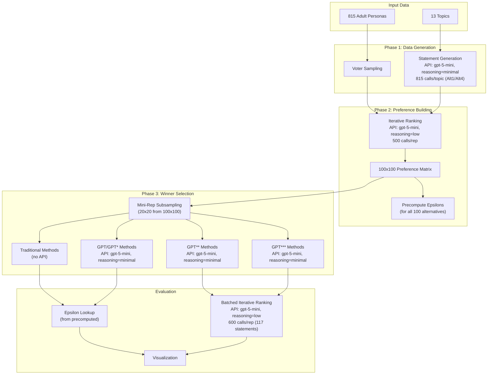
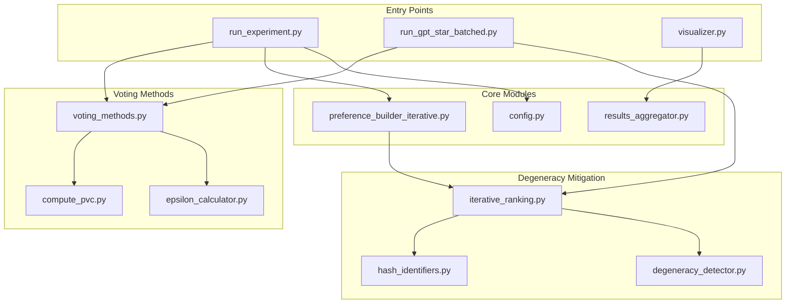

# Single Winner Generative Social Choice

A factorial experiment comparing traditional voting methods vs. GPT-based methods for selecting consensus statements, evaluated using the Proportional Veto Core (PVC) metric.

## Overview

**Research Question**: Can LLMs select consensus statements as well as traditional voting methods?

This project explores how different voting methods select consensus statements from AI-generated personas. The experiment uses **critical epsilon (ε\*)** as the key metric to evaluate consensus quality (lower is better). The factorial design covers:

- **4 Alternative Distributions**: Different strategies for generating candidate statements
- **2 Voter Distributions**: Uniform sampling vs. ideology-based clustering  
- **13 Topics**: Policy questions ranging from healthcare to immigration

## Data Requirements

### Personas

The pre-filtered adult personas (815 personas, age >= 18) are included in this repository at `data/personas/prod/adult.json`.

<details>
<summary>Reproducing from source</summary>

The personas originate from the [SynthLabsAI/PERSONA](https://huggingface.co/datasets/SynthLabsAI/PERSONA) dataset on Hugging Face. This is a **gated dataset** - you must request access from the dataset authors.

After obtaining access, filter to adults (age >= 18):

```python
import json
import re

with open("path/to/full_personas.json") as f:
    personas = json.load(f)

adults = [p for p in personas if int(re.search(r'age:\s*(\d+)', p).group(1)) >= 18]

with open("data/personas/prod/adult.json", "w") as f:
    json.dump(adults, f)

print(f"Filtered to {len(adults)} adult personas")  # Should be 815
```
</details>

## Experiment Flow



**Key distinction for epsilon computation:**
- **Traditional/GPT/GPT\* methods**: Select from existing statements → epsilon looked up from precomputed values
- **GPT\*\*/GPT\*\*\*/Random**: Generate NEW statements → use batched iterative ranking (100 original + 17 new = 117 statements) to determine position among originals, then compute epsilon

## Installation

This project uses [uv](https://docs.astral.sh/uv/) for fast, reliable package management.

```bash
# Install uv (if not already installed)
curl -LsSf https://astral.sh/uv/install.sh | sh

# Sync dependencies (creates virtual environment automatically)
uv sync
```

## Setup

Create a `.env` file in the root directory with your OpenAI API key:

```
OPENAI_API_KEY=your_api_key_here
```

### Model Configuration

All model settings are centralized in `src/experiment_utils/config.py`:

- **STATEMENT_MODEL** (`gpt-5-mini`, reasoning=minimal): Used for statement/alternative generation (Phase 1)
- **GENERATIVE_VOTING_MODEL** (`gpt-5-mini`, reasoning=minimal): Used for GPT-based voting methods (Phase 3 selection/generation)
- **RANKING_MODEL** (`gpt-5-mini`, reasoning=low): Used for all preference/ranking tasks (iterative ranking, epsilon insertion)

### API Metadata Tracking

All OpenAI API calls include metadata for tracking, debugging, and cost analysis via the OpenAI dashboard. The metadata schema includes:

- **Core fields**: `project`, `run_id`, `phase`, `component`
- **Contextual fields**: `topic`, `voter_dist`, `alt_dist`, `method`, `rep`, `mini_rep`, `voter_idx`, `round`

Use `build_api_metadata()` from `src/experiment_utils/config.py` to generate metadata for new API calls. See [`reports/prompt_documentation.md`](reports/prompt_documentation.md) for the full schema.

### Prompt Documentation

For detailed documentation of all LLM API requests including exact system prompts, user prompt templates, model parameters, and response formats, see [`reports/prompt_documentation.md`](reports/prompt_documentation.md).

## Quick Start

Run the full pipeline with a single command:

```bash
# Run full pipeline (skips completed work automatically)
uv run python -m src.sample_alt_voters

# Force re-run everything (ignores existing outputs)
uv run python -m src.sample_alt_voters --force
```

The pipeline runs these stages in order:
1. **generate-statements** - Pre-generate Alt1 and Alt4 statements
2. **run-experiment** - Build preferences and run Traditional/GPT/GPT\* methods
3. **run-generative-voting** - Run GPT\*\*/GPT\*\*\*/Random with batched iterative ranking
4. **visualize** - Generate visualization plots

### Running Individual Stages

```bash
# Run a specific stage only
uv run python -m src.sample_alt_voters --stage generate-statements
uv run python -m src.sample_alt_voters --stage run-experiment
uv run python -m src.sample_alt_voters --stage run-generative-voting
uv run python -m src.sample_alt_voters --stage visualize
```

### Running Individual Conditions

```bash
# Generate statements for a specific topic
uv run python -m src.sample_alt_voters.generate_statements --alt1 --topic abortion

# Run experiment for a specific condition
uv run python -m src.sample_alt_voters.run_experiment --voter-dist uniform --topic abortion --alt-dist persona_no_context
```

### Running Selected Topics

To run the pipeline for a subset of topics (instead of all 13), use the provided script:

```bash
# Run 6 selected topics in tmux (recommended)
tmux new -s six_topics './scripts/run_6topics.sh'

# Or run directly
./scripts/run_6topics.sh
```

The script runs these 6 topics: policing, trust, environment, abortion, electoral, healthcare.

To customize which topics to run, edit the `TOPICS` variable in `scripts/run_6topics.sh` or run individual topics manually:

```bash
# Run a single topic (both voter distributions)
for voter_dist in uniform clustered; do
  uv run python -m src.sample_alt_voters.run_experiment \
    --voter-dist $voter_dist --topic abortion --all-alts
done
```

### Handling Interruptions

All scripts automatically skip completed work and resume from where they left off. Simply re-run the same command after an interruption. Use `--force` to overwrite existing results if needed.

## Project Structure

```
scripts/
├── estimate_costs.py                   # Estimate API costs for the experiment
├── run_gpt_star_batched.py             # Run GPT**/GPT***/Random (Stage 3)
└── run_6topics.sh                      # Run pipeline for 6 selected topics

src/
├── compute_pvc.py                      # PVC veto-by-consumption algorithm
│
├── sample_alt_voters/                  # Main experiment module
│   ├── __init__.py                     # Module docstring and exports
│   ├── __main__.py                     # CLI entry point
│   ├── config.py                       # Experiment config (topics, paths, params)
│   ├── run_experiment.py               # Main experiment runner (Phase 2)
│   ├── results_aggregator.py           # Collect results into DataFrame
│   ├── visualizer.py                   # Generate plots (CDF, heatmaps, bars)
│   ├── verbalized_sampling.py          # Parse verbalized sampling responses
│   ├── plot_rank_histogram.py          # Histogram: rank vs insertion position distributions
│   ├── ideology_classifier.py          # Classify personas by ideology
│   ├── cluster_personas.py             # K-means clustering of personas
│   ├── compute_cluster_stats.py        # Cluster statistics and summaries
│   ├── generate_statements.py          # Generate statements for Alt1/Alt4
│   ├── generate_per_rep_statements.py  # Generate per-rep statements (Alt2/Alt3)
│   │
│   ├── alternative_generators/         # Statement generation strategies
│   │   ├── __init__.py
│   │   ├── persona_no_context.py       # Alt1: persona-based, no context
│   │   ├── persona_context.py          # Alt2: persona + bridging context
│   │   ├── no_persona_context.py       # Alt3: verbalized + context
│   │   └── no_persona_no_context.py    # Alt4: blind verbalized
│   │
│   └── voter_samplers/                 # Voter sampling strategies
│       ├── __init__.py
│       ├── uniform.py                  # Uniform random sampling
│       └── clustered.py                # Ideology-cluster sampling
│
├── experiment_utils/                   # Shared experiment utilities
│   ├── __init__.py
│   ├── config.py                       # Shared configuration constants
│   ├── epsilon_calculator.py           # Critical epsilon computation
│   ├── voting_methods.py               # All voting method implementations
│
└── degeneracy_mitigation/              # Iterative ranking utilities
    ├── __init__.py
    ├── config.py                       # Ranking configuration
    ├── iterative_ranking.py            # 5-round top-K/bottom-K ranking
    ├── degeneracy_detector.py          # Detect degenerate outputs
    └── hash_identifiers.py             # 4-letter hash ID generation

data/
├── personas/
│   └── prod/
│       ├── adult.json                  # 815 adult personas (age >= 18)
│       └── full.json                   # Full persona set
├── sample-alt-voters/
│   ├── sampled-statements/             # Pre-generated statements by distribution
│   └── sampled-context/                # Per-rep context data (13 topics x 10 reps)
├── topics.txt                          # List of 13 discussion topics
└── topic_mappings.json                 # Topic slug to short name mappings

outputs/sample_alt_voters/
├── data/{topic}/uniform/{alt_dist}/rep{N}/        # Uniform voter distribution
│   ├── preferences.json                # 100x100 preference matrix
│   ├── precomputed_epsilons.json       # Epsilon for all 100 alternatives
│   ├── voters.json                     # Sampled voter info
│   ├── summary.json                    # Experiment summary
│   └── mini_rep{0-3}/
│       └── results.json                # All method results per mini-rep
├── data/{topic}/clustered/{ideology}/{alt_dist}/rep{N}/  # Clustered voter distributions
│   └── (same structure as uniform)
└── figures/                            # Visualization plots (PNG)
```

## Code Architecture



## Voting Methods

### Traditional Methods (No API)

| Method | Description |
|--------|-------------|
| **Schulze** | Condorcet-compliant pairwise comparison |
| **Borda** | Positional voting (points by rank) |
| **IRV** | Instant Runoff Voting (elimination rounds) |
| **Plurality** | First-past-the-post (top choice only) |
| **VBC** | Veto by Consumption (PVC-based) |

### GPT-Based Methods

**GPT**: Select from P subsampled alternatives (given P alternatives as context)
- Variants: GPT, GPT+Rank, GPT+Pers

**GPT\***: Select from all 100 sampled alternatives (with topic context)
- Variants: GPT\*, GPT\*+Rank, GPT\*+Pers

**GPT\*\***: Generate a new statement (given P alternatives as context)
- Variants: GPT\*\*, GPT\*\*+Rank, GPT\*\*+Pers

**GPT\*\*\***: Generate a new statement (P alternatives are NOT given - blind generation)
- No variants

| Method | Input | Output |
|--------|-------|--------|
| **GPT** | P statements | Select 1 from P |
| **GPT+Rank** | P statements + rankings | Select 1 from P |
| **GPT+Pers** | P statements + personas | Select 1 from P |
| **GPT\*** | Topic + all 100 statements | Select 1 from 100 |
| **GPT\*+Rank** | Topic + all 100 + rankings | Select 1 from 100 |
| **GPT\*+Pers** | Topic + all 100 + personas | Select 1 from 100 |
| **GPT\*\*** | P statements | Generate new |
| **GPT\*\*+Rank** | P statements + rankings | Generate new |
| **GPT\*\*+Pers** | P statements + personas | Generate new |
| **GPT\*\*\*** | Topic only | Generate new |

## Key Concepts

### Critical Epsilon (ε\*)

The **critical epsilon** measures how well a statement achieves consensus. It represents the minimum "veto power relaxation" needed for a statement to be in the Proportional Veto Core.

- **Lower epsilon = better consensus** (the statement is more broadly acceptable)
- **ε\* = 0** means the statement is in the exact PVC (optimal consensus)
- **ε\* = 1** means the statement is heavily vetoed by some voters

### Proportional Veto Core (PVC)

The PVC is a fair aggregation method based on veto power. Each voter gets proportional "veto tokens" to eliminate disliked alternatives. The PVC contains alternatives that survive all vetoes.

### Iterative Ranking

To build preference matrices, we use iterative top-K/bottom-K ranking to avoid the **81% degeneracy problem** seen with single-call ranking:

1. **5 rounds** of selection per voter
2. Each round: select top 10 and bottom 10 from remaining
3. **Hash identifiers** (4-letter codes) to avoid index/rank conflation
4. **Per-round shuffling** to break presentation order bias
5. **Retry on invalid output** - if a round produces invalid rankings, retry (typically only a few retries needed)

This achieves **~100% valid rankings** with minimal retries, compared to 19% with single-call ranking.

### Chunked Borda Insertion (Experimental)

An experimental alternative to the standard statement insertion algorithm that addresses the "too preferred" bias observed in insertion results. Instead of asking the model to insert a new statement among all 100 ranked alternatives at once:

1. **Chunk the ranking** into 5 consecutive chunks of ~20 statements each
2. **Ask per-chunk**: For each chunk, ask where the new statement should be inserted (returns 0-20)
3. **Calculate Borda score**: Sum how many alternatives the new statement "beats" across all chunks
4. **Determine position**: Convert Borda score to final position in the full ranking

**Key design choices:**
- The prompt tells the model the chunk is "one of 5 chunks" but does NOT reveal which chunk (top/middle/bottom) to avoid biasing toward middle insertions
- No hash identifiers needed since model only returns a position number
- Uses same `RANKING_MODEL` (gpt-5-mini) with `RANKING_REASONING` (low) as standard insertion

**Test Results** (abortion and environment topics, rep0, 10 alternatives each):

| Topic | Position Error Mean | Position Error Std | Absolute Error Mean |
|-------|--------------------:|-------------------:|--------------------:|
| Abortion | -2.70 | 20.56 | 16.26 |
| Environment | -21.94 | 24.44 | 26.07 |
| **Overall** | **-12.32** | **24.55** | **21.16** |

*Note: Negative error means predicted position is too preferred (too low). Results vary significantly by topic.*

**Files:**
- `src/experiment_utils/chunked_insertion.py` - Core algorithm
- `src/experiment_utils/test_chunked_insertion.py` - Validation test
- `outputs/chunked_insertion_test/` - Test results and visualizations

### Random Insertion Distribution Analysis

A visualization tool to compare the distribution of statement ranks vs. insertion positions from the random\_insertion method. This helps validate whether insertion positions follow expected distributions.

**What it plots:**
1. **Statement Ranks (0-99)**: Distribution of all rank positions from voter preferences - expected to be uniform since each voter ranks all 100 statements
2. **Insertion Positions (0-100)**: Distribution of where new statements are inserted using the random\_insertion method

**Run the analysis:**
```bash
uv run python -m src.sample_alt_voters.plot_rank_histogram
```

**Output:**
- Per-topic histograms: `outputs/random_insertion_test/histogram_{topic}.png`
- Combined histogram: `outputs/random_insertion_test/histogram_all_topics.png`

## API Usage Summary

Per topic: 50 reps (4 alt_dists × 10 uniform reps + 1 alt_dist × 10 progressive reps + 1 alt_dist × 10 conservative reps), 200 mini-reps (50 reps × 4 mini-reps each).

| Component | Model | Reasoning | API Calls | Total/Topic | Purpose |
|-----------|-------|-----------|-----------|-------------|---------|
| Statement Generation | gpt-5-mini | minimal | 815/topic | 815 | Generate candidate statements (Alt1/Alt4) |
| Preference Building | gpt-5-mini | low | 500/rep | 24,000 | 5 rounds × 100 voters iterative ranking |
| GPT/GPT\* Selection | gpt-5-mini | minimal | 1/method | 1,440 | Select consensus from statements |
| GPT\*\* Generation | gpt-5-mini | minimal | 12/rep | 600 | Generate 3 new statements per mini-rep (4 mini-reps × 3 variants) |
| GPT\*\*\* Generation | gpt-5-mini | minimal | 4/rep | 200 | Generate 1 blind bridging statement per mini-rep |
| Batched Iterative Ranking | gpt-5-mini | low | 600/rep | 30,000 | Rank 120 statements (100 original + 20 new) per voter |

**Total per topic: ~51,000 API calls**

**Epsilon Computation:**
- **Precomputed**: Traditional methods, GPT, GPT\* → lookup from `precomputed_epsilons.json`
- **Batched Iterative Ranking**: GPT\*\*, GPT\*\*\*, Random → batch all 17 new statements with 100 originals, run iterative ranking, extract positions relative to originals only

### Batched Iterative Ranking

For GPT\*\* and GPT\*\*\* methods, we use batched iterative ranking instead of single-call insertion:

1. **Batch all new statements**: Per mini-rep: 3 GPT\*\* variants + 1 GPT\*\*\* + 1 Random = 5 statements. Total: 4 mini-reps × 5 = 20 new statements per rep
2. **Run ONE iterative ranking** per voter with 120 statements (100 original + 20 new)
3. **Extract positions** relative to original statements only (discounting other new statements)
4. **Compute epsilon** from the positions

This approach is more accurate than single-call insertion (which was biased toward "too preferred") and achieves 20× cost savings over individual insertion.

## Alternative Distributions

| Distribution | Persona | Context | Description |
|--------------|---------|---------|-------------|
| **Alt1** | Yes | No | Persona-generated statements (pre-generated pool) |
| **Alt2** | Yes | Yes | Persona + bridging context (per-rep generation) |
| **Alt3** | No | Yes | Verbalized sampling with context (per-rep) |
| **Alt4** | No | No | Blind verbalized statements (pre-generated pool) |

## Voter Distributions

| Distribution | Description | Reps |
|--------------|-------------|------|
| **Uniform** | Random sample from all 815 personas | 10 reps |
| **progressive_liberal** | Sample from progressive/liberal ideology cluster | 10 reps |
| **conservative_traditional** | Sample from conservative/traditional ideology cluster | 10 reps |

## Topics

The experiment covers 13 policy discussion topics:

1. Trust in institutions
2. Littering policies
3. Campus free speech
4. Environment vs. economy
5. Gun safety laws
6. Free speech limits
7. Immigration policy
8. Electoral College reform
9. Tech privacy
10. AI in society
11. Healthcare
12. Abortion laws
13. Policing strategies

## Data Structure

Results are organized hierarchically with different path structures for uniform vs clustered voter distributions:

**Uniform voter distribution:**
```
outputs/sample_alt_voters/data/{topic}/uniform/{alt_dist}/rep{N}/
├── preferences.json           # 100x100 preference matrix [rank][voter] = alt_id
├── precomputed_epsilons.json  # {alt_id: epsilon} for all 100 alternatives
├── voters.json                # {voter_dist, voter_indices, n_voters}
├── summary.json               # Experiment metadata and timing
└── mini_rep{0-3}/
    └── results.json           # Per-method results {winner, epsilon, ...}
```

**Clustered voter distribution:**
```
outputs/sample_alt_voters/data/{topic}/clustered/{voter_dist}/{alt_dist}/rep{N}/
├── preferences.json           # 100x100 preference matrix [rank][voter] = alt_id
├── precomputed_epsilons.json  # {alt_id: epsilon} for all 100 alternatives
├── voters.json                # {voter_dist, voter_indices, n_voters}
├── summary.json               # Experiment metadata and timing
└── mini_rep{0-3}/
    └── results.json           # Per-method results {winner, epsilon, ...}
```

Where `{voter_dist}` is `progressive_liberal` or `conservative_traditional`.

**Results in mini-rep results.json:**
- Traditional methods: Schulze, Borda, IRV, Plurality, VBC
- GPT methods: chatgpt, chatgpt_rankings, chatgpt_personas, chatgpt_star, chatgpt_star_rankings, chatgpt_star_personas
- GPT\*\* methods: chatgpt_double_star, chatgpt_double_star_rankings, chatgpt_double_star_personas
- GPT\*\*\* method: chatgpt_triple_star
- Random baseline: random_insertion

## Paper Plots

Generate paper-quality plots comparing generative ChatGPT methods (GPT\*\*, GPT\*\*\*, Random Insertion) vs VBC:

```bash
uv run python scripts/generate_paper_plots.py
```

**Output:** `outputs/paper/plots/`

**Cross-topic visualizations:**
- `heatmap_method_topic.png` - Method × Topic mean epsilon heatmap
- `win_tie_loss.png` - Stacked bar chart showing win/tie/loss rates vs VBC
- `zero_breakdown.png` - % of epsilon=0 vs epsilon>0 by method
- `contingency_tables.png` - 2×2 contingency tables (VBC vs GPT zero/non-zero)
- `epsilon_when_vbc_fails.png` - GPT epsilon distribution when VBC has epsilon > 0
- `threshold_exceedance.png` - P(epsilon > threshold) for various thresholds
- `combined_cdf_all_topics.png` - 2×3 grid of CDF plots for all topics
- `tables/` - CSV and LaTeX summary tables with Mann-Whitney U tests

**Per-topic visualizations** (in `{topic}/` subdirectories):
- `cdf_{topic}.png` - Zoomed CDF (y_min=0.5, x_max=0.5)
- `cdf_{topic}_full.png` - Full CDF (y_min=0, x_max=1)
- `boxplot_{topic}.png` - Box plot by method
- `scatter_{topic}.png` - 2×2 paired scatter plots (VBC vs GPT epsilon)
- `bar_ci_{topic}.png` - Bar chart with 95% confidence intervals
- `cdf_nonzero_{topic}.png` - CDF for non-zero epsilon values only
- `strip_{topic}.png` - Strip plot with zero/non-zero separation

**Methods compared by category:**

| Category | Methods | Description |
|----------|---------|-------------|
| **Traditional** | VBC, Borda, Schulze, IRV, Plurality | Classic voting methods |
| **Selection** | GPT-Select, GPT-Sel+Rank, GPT-Sel+Pers, GPT-Full, GPT-Full+Rank, GPT-Full+Pers | GPT/GPT\* methods that select from existing alternatives |
| **Generative** | GPT-Blind, GPT-Synthesize, GPT-Synth+Rank, GPT-Synth+Pers | GPT\*\*/GPT\*\*\* methods that generate new statements |

**Output tables:** `outputs/paper/tables/{voter_dist}/`

Each voter distribution (uniform, progressive, conservative) has three subfolders:
- `traditional/` - Traditional voting method results
- `generative/` - GPT\*\*/GPT\*\*\* generative method results
- `selection/` - GPT/GPT\* selection method results

Each folder contains CSV and LaTeX tables for: mean, p90, p95, p99, pct_zero, pct_lt_0.0001, pct_lt_0.001, pct_lt_0.01, pct_lt_0.05, pct_lt_0.1 (all by topic).

**Output plots:** `outputs/slides/by_topic_full/`

CDF plots organized by method category:
- `cdf_traditional_group1.pdf` / `cdf_traditional_group2.pdf` - Traditional methods
- `cdf_selection_group1.pdf` / `cdf_selection_group2.pdf` - Selection methods (GPT/GPT\*)
- `cdf_generative_group1.pdf` / `cdf_generative_group2.pdf` - Generative methods (GPT\*\*/GPT\*\*\*)

Group1: Abortion, Electoral College, Healthcare | Group2: Policing, Environment, Trust in Institutions

**Data:** Filters to persona_no_context (Alt1) condition only.

## License

MIT License
