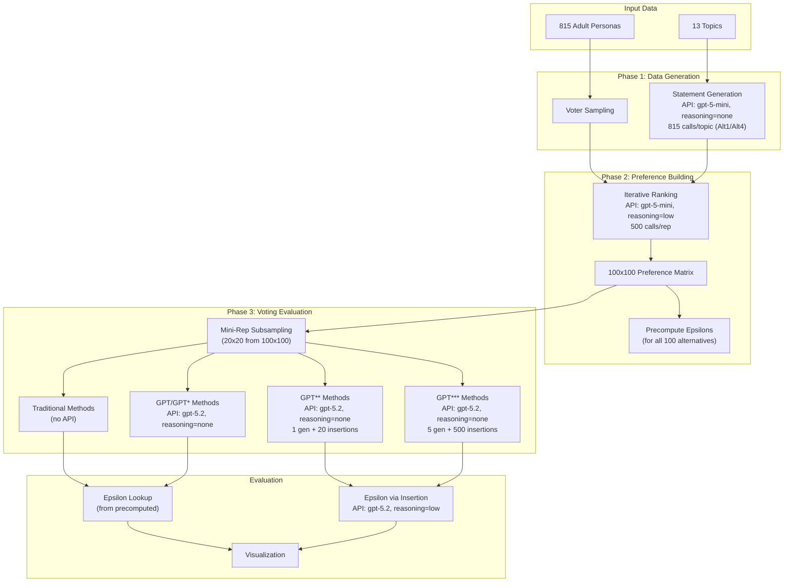

# Single Winner Generative Social Choice

A factorial experiment comparing traditional voting methods vs. GPT-based methods for selecting consensus statements, evaluated using the Proportional Veto Core (PVC) metric.

## Overview

**Research Question**: Can LLMs select consensus statements as well as traditional voting methods?

This project explores how different voting methods select consensus statements from AI-generated personas. The experiment uses **critical epsilon (ε\*)** as the key metric to evaluate consensus quality (lower is better). The factorial design covers:

- **4 Alternative Distributions**: Different strategies for generating candidate statements
- **2 Voter Distributions**: Uniform sampling vs. ideology-based clustering  
- **13 Topics**: Policy questions ranging from healthcare to immigration

## Data Requirements

### Personas

The personas used in this experiment are from the [SynthLabsAI/PERSONA](https://huggingface.co/datasets/SynthLabsAI/PERSONA) dataset on Hugging Face. This is a **gated dataset** - you must request access from the dataset authors before use.

After obtaining access, filter the personas to adults only (age >= 18) and save to `data/personas/prod/adult.json`:

```python
import json
import re

# Load the full dataset and filter to adults
with open("path/to/full_personas.json") as f:
    personas = json.load(f)

adults = [p for p in personas if int(re.search(r'age:\s*(\d+)', p).group(1)) >= 18]

with open("data/personas/prod/adult.json", "w") as f:
    json.dump(adults, f)

print(f"Filtered to {len(adults)} adult personas")  # Should be 815
```

## Experiment Flow



**Key distinction for epsilon computation:**
- **Traditional/GPT/GPT\* methods**: Select from existing statements → epsilon looked up from precomputed values
- **GPT\*\*/GPT\*\*\* methods**: Generate NEW statements → must insert into voter rankings via API calls, then compute epsilon

## Installation

This project uses [uv](https://docs.astral.sh/uv/) for fast, reliable package management.

```bash
# Install uv (if not already installed)
curl -LsSf https://astral.sh/uv/install.sh | sh

# Sync dependencies (creates virtual environment automatically)
uv sync
```

## Setup

Create a `.env` file in the root directory with your OpenAI API key:

```
OPENAI_API_KEY=your_api_key_here
```

## Quick Start

There is no single command for the full pipeline. Run these steps in order:

```bash
# 1. Generate statements (Phase 1)
uv run python -m src.sample_alt_voters.generate_statements --all

# 2. Run main experiment (Phase 2) - builds preferences and runs voting methods
uv run python -m src.sample_alt_voters.run_experiment --voter-dist uniform --all-topics --all-alts
uv run python -m src.sample_alt_voters.run_experiment --voter-dist clustered --all-topics --all-alts

# 3. Fix GPT** epsilon values
uv run python -m src.sample_alt_voters.fix_star_epsilons --double-star-only

# 4. Run GPT*** method
uv run python -m src.sample_alt_voters.run_triple_star

# 5. Generate visualization plots
uv run python -m src.sample_alt_voters.visualizer --all
```

### Running Individual Conditions

```bash
# Generate statements for a specific topic
uv run python -m src.sample_alt_voters.generate_statements --alt1 --topic abortion

# Run experiment for a specific condition
uv run python -m src.sample_alt_voters.run_experiment --voter-dist uniform --topic abortion --alt-dist persona_no_context
```

### Handling Interruptions

All scripts automatically skip completed work and resume from where they left off. Simply re-run the same command after an interruption. Use `--force` to overwrite existing results if needed.

## Project Structure

```
src/
├── compute_pvc.py                      # PVC veto-by-consumption algorithm
│
├── sample_alt_voters/                  # Main experiment module
│   ├── __init__.py                     # Module docstring and exports
│   ├── __main__.py                     # CLI entry point
│   ├── config.py                       # Experiment config (topics, paths, params)
│   ├── run_experiment.py               # Main experiment runner (Phase 2)
│   ├── run_triple_star.py              # GPT*** blind bridging runner
│   ├── fix_star_epsilons.py            # Fix epsilon values for GPT** methods
│   ├── preference_builder_iterative.py # Build 100x100 preference matrices
│   ├── results_aggregator.py           # Collect results into DataFrame
│   ├── visualizer.py                   # Generate plots (CDF, heatmaps, bars)
│   ├── verbalized_sampling.py          # Parse verbalized sampling responses
│   ├── ideology_classifier.py          # Classify personas by ideology
│   ├── cluster_personas.py             # K-means clustering of personas
│   ├── compute_cluster_stats.py        # Cluster statistics and summaries
│   ├── generate_statements.py          # Generate statements for Alt1/Alt4
│   ├── generate_per_rep_statements.py  # Generate per-rep statements (Alt2/Alt3)
│   │
│   ├── alternative_generators/         # Statement generation strategies
│   │   ├── __init__.py
│   │   ├── persona_no_context.py       # Alt1: persona-based, no context
│   │   ├── persona_context.py          # Alt2: persona + bridging context
│   │   ├── no_persona_context.py       # Alt3: verbalized + context
│   │   └── no_persona_no_context.py    # Alt4: blind verbalized
│   │
│   └── voter_samplers/                 # Voter sampling strategies
│       ├── __init__.py
│       ├── uniform.py                  # Uniform random sampling
│       └── clustered.py                # Ideology-cluster sampling
│
├── sampling_experiment/                # Shared experiment utilities
│   ├── __init__.py
│   ├── config.py                       # Shared configuration constants
│   ├── epsilon_calculator.py           # Critical epsilon computation
│   ├── voting_methods.py               # All voting method implementations
│   └── single_call_ranking.py          # Insert statements into rankings
│
└── degeneracy_mitigation/              # Iterative ranking utilities
    ├── __init__.py
    ├── config.py                       # Ranking configuration
    ├── iterative_ranking.py            # 5-round top-K/bottom-K ranking
    ├── degeneracy_detector.py          # Detect degenerate outputs
    └── hash_identifiers.py             # 4-letter hash ID generation

data/
├── personas/
│   └── prod/
│       ├── adult.json                  # 815 adult personas (age >= 18)
│       └── full.json                   # Full persona set
├── sample-alt-voters/
│   ├── sampled-statements/             # Pre-generated statements by distribution
│   └── sampled-context/                # Per-rep context data (13 topics x 10 reps)
├── topics.txt                          # List of 13 discussion topics
└── topic_mappings.json                 # Topic slug to short name mappings

outputs/sample_alt_voters/
├── data/{topic}/{voter_dist}/{alt_dist}/rep{N}/
│   ├── preferences.json                # 100x100 preference matrix
│   ├── precomputed_epsilons.json       # Epsilon for all 100 alternatives
│   ├── voters.json                     # Sampled voter info
│   ├── summary.json                    # Experiment summary
│   ├── chatgpt_triple_star.json        # GPT*** results (if run)
│   └── mini_rep{0-4}/
│       └── results.json                # Voting method results per mini-rep
└── figures/                            # Visualization plots (PNG)
```

## Code Architecture


## Voting Methods

### Traditional Methods (No API)

| Method | Description |
|--------|-------------|
| **Schulze** | Condorcet-compliant pairwise comparison |
| **Borda** | Positional voting (points by rank) |
| **IRV** | Instant Runoff Voting (elimination rounds) |
| **Plurality** | First-past-the-post (top choice only) |
| **VBC** | Veto by Consumption (PVC-based) |

### GPT-Based Methods

| Method | Input | Output | Description |
|--------|-------|--------|-------------|
| **GPT** | 20 sample statements | Select 1 | Baseline selection |
| **GPT+Rank** | 20 statements + rankings | Select 1 | Selection with preference info |
| **GPT+Pers** | 20 statements + personas | Select 1 | Selection with voter personas |
| **GPT\*** | All 100 statements | Select 1 | Selection from full pool |
| **GPT\*+Rank** | 100 statements + rankings | Select 1 | Full pool with preferences |
| **GPT\*+Pers** | 100 statements + personas | Select 1 | Full pool with personas |
| **GPT\*\*** | 20 statements + context | Generate new | Create new consensus statement |
| **GPT\*\*+Rank** | 20 statements + rankings | Generate new | New statement using preferences |
| **GPT\*\*+Pers** | 20 statements + personas | Generate new | New statement using personas |
| **GPT\*\*\*** | Topic only | Generate new | Blind bridging (no context) |

## Key Concepts

### Critical Epsilon (ε\*)

The **critical epsilon** measures how well a statement achieves consensus. It represents the minimum "veto power relaxation" needed for a statement to be in the Proportional Veto Core.

- **Lower epsilon = better consensus** (the statement is more broadly acceptable)
- **ε\* = 0** means the statement is in the exact PVC (optimal consensus)
- **ε\* = 1** means the statement is heavily vetoed by some voters

### Proportional Veto Core (PVC)

The PVC is a fair aggregation method based on veto power. Each voter gets proportional "veto tokens" to eliminate disliked alternatives. The PVC contains alternatives that survive all vetoes.

### Iterative Ranking

To build preference matrices, we use iterative top-K/bottom-K ranking to avoid the **81% degeneracy problem** seen with single-call ranking:

1. **5 rounds** of selection per voter
2. Each round: select top 10 and bottom 10 from remaining
3. **Hash identifiers** (4-letter codes) to avoid index/rank conflation
4. **Per-round shuffling** to break presentation order bias
5. **Retry on invalid output** - if a round produces invalid rankings, retry (typically only a few retries needed)

This achieves **~100% valid rankings** with minimal retries, compared to 19% with single-call ranking.

## API Usage Summary

Per topic: 48 reps (4 alt_dists × 12 reps), 240 mini-reps (48 reps × 5 mini-reps each).

| Component | Model | Reasoning | API Calls | Total/Topic | Purpose |
|-----------|-------|-----------|-----------|-------------|---------|
| Statement Generation | gpt-5-mini | none | 815/topic | 815 | Generate candidate statements (Alt1/Alt4) |
| Preference Building | gpt-5-mini | low | 500/rep | 24,000 | 5 rounds × 100 voters iterative ranking |
| GPT/GPT\* Selection | gpt-5.2 | none | 1/method | 1,440 | Select consensus from statements |
| GPT\*\* Generation | gpt-5.2 | none | 1/method | 720 | Generate new consensus statement |
| GPT\*\* Insertion | gpt-5.2 | low | 20/method | 14,400 | Insert new stmt into mini-rep rankings |
| GPT\*\*\* Generation | gpt-5.2 | none | 5/rep | 240 | Generate 5 blind bridging statements |
| GPT\*\*\* Insertion | gpt-5.2 | low | 500/rep | 24,000 | Insert each stmt into all 100 rankings |

**Total per topic: ~65,000 API calls**

**Epsilon Computation:**
- **Precomputed**: Traditional methods, GPT, GPT\* → lookup from `precomputed_epsilons.json`
- **Insertion-based**: GPT\*\*, GPT\*\*\* → insert new statement into voter rankings via API, then compute epsilon

## Alternative Distributions

| Distribution | Persona | Context | Description |
|--------------|---------|---------|-------------|
| **Alt1** | Yes | No | Persona-generated statements (pre-generated pool) |
| **Alt2** | Yes | Yes | Persona + bridging context (per-rep generation) |
| **Alt3** | No | Yes | Verbalized sampling with context (per-rep) |
| **Alt4** | No | No | Blind verbalized statements (pre-generated pool) |

## Voter Distributions

| Distribution | Description | Reps |
|--------------|-------------|------|
| **Uniform** | Random sample from all 815 personas | 10 reps |
| **Clustered** | Sample from ideology clusters | 2 reps (progressive, conservative) |

## Topics

The experiment covers 13 policy discussion topics:

1. Trust in institutions
2. Littering policies
3. Campus free speech
4. Environment vs. economy
5. Gun safety laws
6. Free speech limits
7. Immigration policy
8. Electoral College reform
9. Tech privacy
10. AI in society
11. Healthcare
12. Abortion laws
13. Policing strategies

## Data Structure

Results are organized hierarchically:

```
outputs/sample_alt_voters/data/{topic}/{voter_dist}/{alt_dist}/rep{N}/
├── preferences.json           # 100x100 preference matrix [rank][voter] = alt_id
├── precomputed_epsilons.json  # {alt_id: epsilon} for all 100 alternatives
├── voters.json                # {voter_dist, voter_indices, n_voters}
├── summary.json               # Experiment metadata and timing
├── chatgpt_triple_star.json   # GPT*** results (epsilon, statements)
└── mini_rep{0-4}/
    └── results.json           # Per-method results {winner, epsilon, ...}
```

## Refactoring Notes

The `sampling_experiment/` folder contains shared utilities (voting methods, epsilon calculation) rather than a standalone experiment. Consider renaming to `experiment_utils/` for clarity.

## Citation

If you use this code, please cite the relevant papers on Proportional Veto Core and generative social choice.

## License

[Add license information here]
