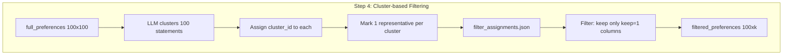

# PVC Bridging Experiment

Evaluate voting methods under epsilon-PVC bridging. FULL preference profile built BEFORE filtering. Filtering uses LLM clustering with a keep-flag structure.

## Step Order

```
Step 1: Sample 100 entries (persona + statement pairs) from existing data
Step 2: Generate 100 bridging statements (one per persona)
Step 3: Build FULL 100x100 preference profile (rankings + Likert)
Step 4: LLM clusters similar statements, marks one per cluster to keep
Step 5: Sample 20 personas → 20 x k matrix (k = number of clusters)
Step 6: Run 7 voting methods
Step 7: Compute critical epsilon for each winner
```

## Step 4: Filtering Data Structure

The LLM clusters similar statements. Output is a list of 100 entries:

```json
[
  {"statement_idx": 0, "cluster_id": 0, "keep": 1},
  {"statement_idx": 1, "cluster_id": 0, "keep": 0},
  {"statement_idx": 2, "cluster_id": 1, "keep": 1},
  {"statement_idx": 3, "cluster_id": 2, "keep": 1},
  {"statement_idx": 4, "cluster_id": 0, "keep": 0},
  ...
]
```

**Rules:**
- Every statement gets a `cluster_id`
- Within each cluster, exactly ONE statement has `keep=1`, rest have `keep=0`
- Statements in the same cluster are "very similar"
- Unique statements form singleton clusters (cluster of 1, that 1 has keep=1)
- `k` = number of unique clusters = count of statements with `keep=1`

**Filtering the preference matrix:**
- Keep only columns where `keep=1`
- Re-rank each voter's preferences over the kept statements

## Data Flow



## Complete Data Persistence

Directory: `outputs/full_experiment/data/{topic}/rep{i}/`

| Step | File | Contents |
|------|------|----------|
| 1 | `sampled_indices.json` | 100 indices into original file (persona + statement bundled) |
| 2 | `bridging_statements.json` | 100 bridging statements |
| 3 | `full_preferences.json` | 100x100 preference matrix |
| 3 | `full_likert.json` | 100x100 Likert ratings |
| **4** | **`filter_assignments.json`** | **List of {statement_idx, cluster_id, keep}** |
| 4 | `filtered_preferences.json` | 100xk filtered matrix |
| 4 | `filtered_likert.json` | 100xk filtered Likert |
| 5-7 | `sample{j}/persona_indices.json` | 20 sampled persona indices |
| 5-7 | `sample{j}/preferences.json` | 20xk matrix |
| 5-7 | `sample{j}/results.json` | Winners + epsilon per method |

## Ablation Handling

| Ablation | Step 4 Behavior |
|----------|-----------------|
| **Full pipeline** | LLM clusters, keep one per cluster |
| **No bridging** | LLM clusters original statements |
| **No filtering** | All 100 statements: each is own cluster, all keep=1 |

## Module Structure: `src/full_experiment/`

| File | Key Functions |
|------|---------------|
| `config.py` | `TOPICS`, `OUTPUT_DIR`, `N_PERSONAS=100`, `N_SAMPLE=20` |
| `data_loader.py` | `sample_entries()`, `load_all_statements()` |
| `bridging_generator.py` | `generate_bridging_statements()` |
| `preference_builder.py` | `build_full_preferences()`, `build_full_likert()` |
| `statement_filter.py` | `cluster_statements()` → `filter_assignments.json` |
| `voting_runner.py` | `run_voting_methods()`, `compute_epsilon()` |
| `visualizer.py` | `plot_epsilon_histogram()`, `plot_epsilon_barplot()` |
| `run_experiment.py` | `main()` with caching and ablation loops |

## Execution

```bash
# Install dependency
uv add pvc-toolbox

# Test run (2 questions)
uv run python -m src.full_experiment.run_experiment --test

# Full run in tmux
tmux new -s experiment
uv run python -m src.full_experiment.run_experiment
```

## Test Questions
- `what-principles-should-guide-immigration-policy-an`
- `what-are-the-best-policies-to-prevent-littering-in`


