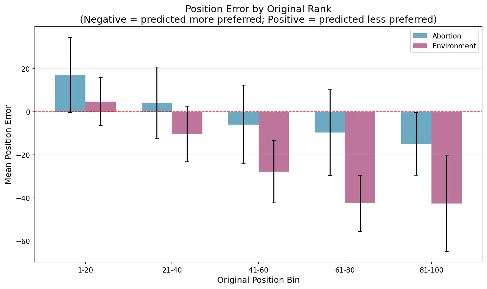
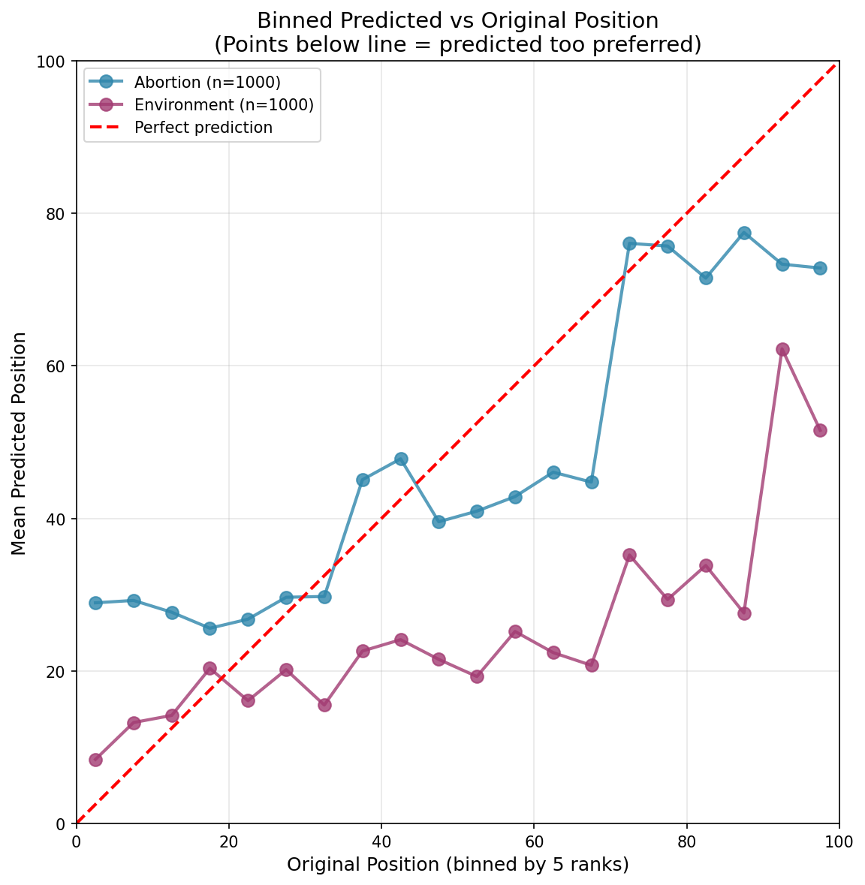
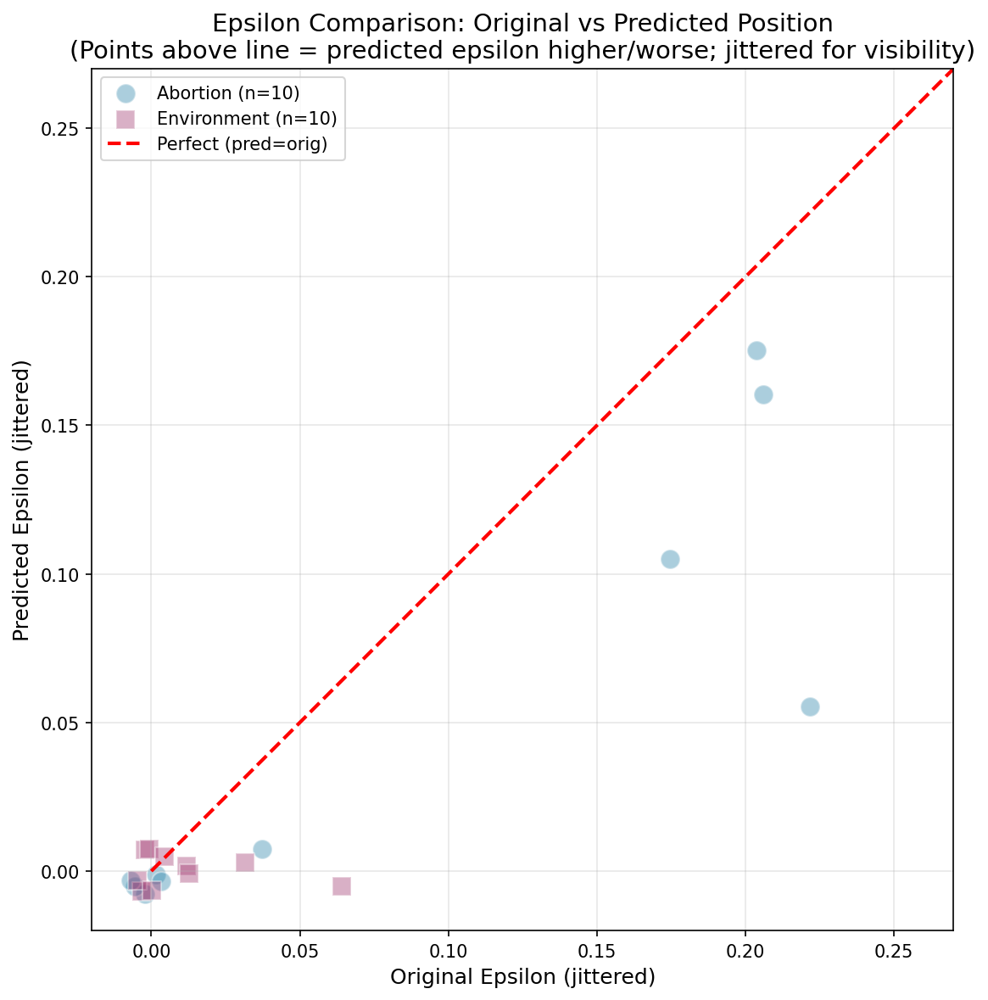

# Chunked Borda Insertion Experiment Report

**Date**: January 30, 2026  
**Topics Tested**: Abortion, Environment  
**Test Scope**: Rep 0, 10 alternatives per topic, 100 voters each

## Executive Summary

This report evaluates a **chunked Borda insertion algorithm** as an alternative to the standard single-call insertion method used in GPT\*\* and GPT\*\*\* methods. The goal was to address the observed "too preferred" bias where the model tends to rank new statements too highly.

**Key Finding**: The chunked Borda approach shows **inconsistent results across topics**:
- **Abortion**: Mean position error of -2.7 (slight improvement)
- **Environment**: Mean position error of -21.9 (significant "too preferred" bias persists)

The algorithm does not reliably fix the insertion bias problem and increases API costs by 5x.

---

## Background

### Problem Statement

The standard insertion API call asks a model to place a new statement among 100 ranked alternatives. Empirically, this produces rankings that are "too preferred" (the new statement is placed higher than it should be), even for mediocre statements.

### Proposed Solution: Chunked Borda

Instead of one insertion call across 100 statements:

1. **Divide** the 100 statements into 5 chunks of ~20 consecutive statements each
2. **Query** the model for each chunk: "Where would you insert this new statement among these 20?"
3. **Aggregate** using Borda scoring: count how many statements the new one "beats" across all chunks
4. **Convert** Borda score to final position in the full ranking

### Key Design Choices

- Prompt tells model the chunk is "one of 5 chunks" but does NOT reveal which chunk (top/middle/bottom) to avoid middle-insertion bias
- No hash identifiers (model only returns position number 0-20)
- Uses same model settings as standard insertion: `gpt-5-mini` with `low` reasoning effort

---

## Methodology

### Test Design

For each topic:
1. Select 10 test alternatives using stratified sampling (3 from top, 4 from middle, 3 from bottom)
2. For each alternative and each of 100 voters:
   - Remove the alternative from the voter's ranking
   - Run chunked Borda to predict where it would be inserted
   - Compare predicted position to original position

### Metrics

- **Position Error**: `predicted_position - original_position`
  - Negative = predicted more preferred than actual
  - Positive = predicted less preferred than actual
- **Absolute Error**: `|position_error|`
- **Epsilon Comparison**: Critical epsilon at predicted vs original position

---

## Results

### Position Error Summary

| Topic | Mean Error | Std Dev | Median | Absolute Error Mean |
|-------|----------:|--------:|-------:|--------------------:|
| Abortion | **-2.70** | 20.56 | -2.0 | 16.26 |
| Environment | **-21.94** | 24.44 | -20.0 | 26.07 |
| **Overall** | **-12.32** | 24.55 | -10.0 | 21.16 |

### Interpretation

- **Abortion**: The algorithm performs reasonably well with only a 2.7 position bias toward "too preferred"
- **Environment**: The algorithm fails significantly, predicting positions ~22 ranks too preferred on average
- **High Variance**: Standard deviation of 20-24 positions indicates substantial prediction uncertainty

### Position Error by Original Rank

The bias pattern varies by where alternatives originally ranked:
- Abortion shows relatively consistent small negative bias across all position bins
- Environment shows large negative bias across all bins, especially for lower-ranked alternatives

### Predicted vs Original Position (Binned)

- Abortion (blue) tracks close to the perfect prediction line
- Environment (pink) consistently falls below the line, indicating systematic over-ranking

### Epsilon Comparison

| Topic | Mean ε Difference | Std Dev | Range |
|-------|------------------:|--------:|------:|
| Abortion | -0.033 | 0.048 | -0.16 to 0 |
| Environment | -0.013 | 0.022 | -0.07 to 0 |

**Observation**: Predicted epsilon is always ≤ original epsilon. This is expected since the algorithm predicts "too preferred" positions, which naturally leads to lower (better) epsilon values.

---

## Cost Analysis

### Per Insertion

| Method | API Calls | Est. Input Tokens | Est. Output Tokens |
|--------|----------:|------------------:|-------------------:|
| Standard | 1 | ~5,500 | ~20 |
| Chunked Borda | 5 | ~3,400 × 5 = ~17,000 | ~20 × 5 = ~100 |

**Cost Multiplier**: ~3x more tokens per insertion, 5x more API calls

### Test Run Costs

- Abortion (1000 insertions): ~$0.50
- Environment (1000 insertions): ~$0.50
- **Total Test**: ~$1.00

---

## Conclusions

### Does Chunked Borda Fix the "Too Preferred" Bias?

**No, not reliably.** Results are highly topic-dependent:
- Works reasonably for abortion (mean error -2.7)
- Fails for environment (mean error -21.9)

### Why the Topic Difference?

Possible explanations:
1. **Statement characteristics**: Environment statements may be more similar to each other, making fine-grained ranking harder
2. **Model familiarity**: The model may have different levels of competence on different topics
3. **Chunk boundary effects**: The chunking may interact differently with different statement distributions

### Recommendation

**Do not adopt chunked Borda as a replacement** for the standard insertion method at this time:
1. Inconsistent improvement across topics
2. 5x increase in API calls
3. Higher token costs
4. Additional implementation complexity

### Alternative Approaches to Explore

1. **Calibration**: Post-hoc adjustment of insertion positions based on observed bias
2. **Temperature tuning**: Experiment with different temperature settings
3. **Prompt engineering**: Refine the standard insertion prompt to reduce bias
4. **Ensemble methods**: Combine multiple insertion calls with different prompts

---

## Files and Artifacts

### Code
- `src/experiment_utils/chunked_insertion.py` - Core algorithm implementation
- `src/experiment_utils/test_chunked_insertion.py` - Test runner
- `src/experiment_utils/analyze_chunked_insertion.py` - Analysis and visualization

### Data
- `outputs/chunked_insertion_test/{topic}/rep0/test_results.json` - Raw results
- `outputs/chunked_insertion_test/{topic}/rep0/summary.json` - Summary statistics
- `outputs/chunked_insertion_test/analysis/` - Comparison reports

### Figures
- `outputs/chunked_insertion_test/figures/position_error_distribution.png`
- `outputs/chunked_insertion_test/figures/predicted_vs_original_scatter.png`
- `outputs/chunked_insertion_test/figures/predicted_vs_original_scatter_binned.png`
- `outputs/chunked_insertion_test/figures/error_by_original_position.png`
- `outputs/chunked_insertion_test/figures/epsilon_comparison.png`
- `outputs/chunked_insertion_test/figures/epsilon_original_vs_predicted.png`

---

## Appendix: Per-Alternative Results

### Abortion (Rep 0)

| Alt ID | Original ε | Mean Orig Pos | Mean Pred Pos | Mean Error |
|-------:|-----------:|--------------:|--------------:|-----------:|
| 1 | 0.00 | 52.96 | 49.06 | -3.90 |
| 7 | 0.03 | 42.33 | 43.67 | +1.34 |
| 17 | 0.20 | 56.76 | 61.57 | +4.81 |
| 39 | 0.22 | 54.34 | 53.93 | -0.41 |
| 41 | 0.18 | 59.42 | 58.08 | -1.34 |
| 47 | 0.00 | 43.85 | 37.06 | -6.79 |
| 48 | 0.00 | 50.01 | 40.15 | -9.86 |
| 68 | 0.20 | 53.68 | 58.95 | +5.27 |
| 71 | 0.00 | 41.47 | 31.46 | -10.01 |
| 93 | 0.00 | 54.36 | 48.21 | -6.15 |

### Environment (Rep 0)

| Alt ID | Original ε | Mean Orig Pos | Mean Pred Pos | Mean Error |
|-------:|-----------:|--------------:|--------------:|-----------:|
| 1 | 0.01 | 37.95 | 14.58 | -23.37 |
| 7 | 0.07 | 56.53 | 43.96 | -12.57 |
| 17 | 0.00 | 44.12 | 21.15 | -22.97 |
| 39 | 0.00 | 43.88 | 36.02 | -7.86 |
| 41 | 0.00 | 40.46 | 12.85 | -27.61 |
| 47 | 0.00 | 36.82 | 29.70 | -7.12 |
| 48 | 0.00 | 44.47 | 16.80 | -27.67 |
| 68 | 0.00 | 41.10 | 14.93 | -26.17 |
| 71 | 0.03 | 48.07 | 25.79 | -22.28 |
| 93 | 0.02 | 76.45 | 34.66 | -41.79 |
