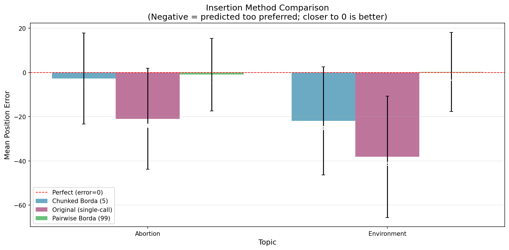
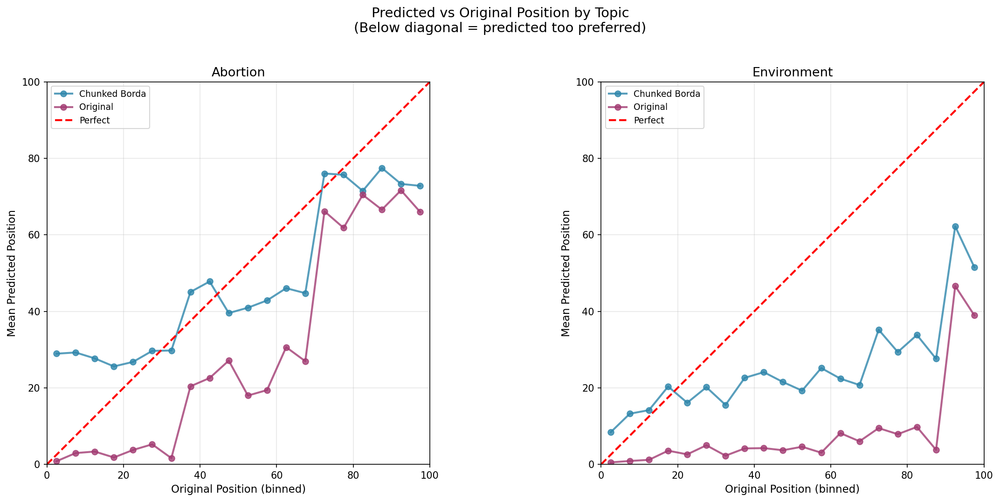
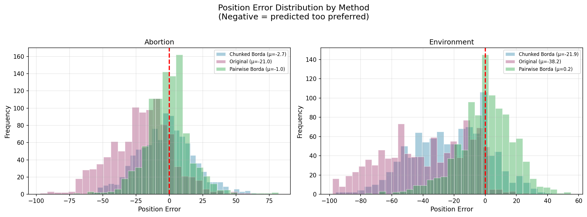

# Insertion Method Comparison Report

**Date**: January 30, 2026  
**Methods Compared**: Chunked Borda (5 chunks) vs Original (single-call)  
**Topics Tested**: Abortion, Environment  
**Test Scope**: Rep 0, 10 alternatives per topic, 100 voters each

## Executive Summary

This report compares two insertion methods for placing new statements into voter preference rankings:

1. **Chunked Borda**: Divides the 99 existing statements into 5 chunks, asks for insertion position in each chunk, then aggregates using Borda scores
2. **Original (single-call)**: Asks the model to insert the new statement among all 99 statements at once

**Key Finding**: **Chunked Borda significantly outperforms the original method**, reducing the "too preferred" bias by an average of **17.25 positions**.

---

## Results Summary

| Topic | Chunked Borda | Original | Improvement | Improvement % |
|-------|-------------:|----------:|------------:|--------------:|
| Abortion | **-2.70** | -20.98 | +18.27 | 87% |
| Environment | **-21.94** | -38.17 | +16.22 | 43% |
| **Average** | **-12.32** | **-29.57** | **+17.25** | **58%** |

*Negative error = predicted position is too preferred (ranked too high). Closer to 0 is better.*

---

## Detailed Analysis

### Position Error by Topic

**Observations**:
- Both methods show "too preferred" bias (negative errors)
- Chunked Borda consistently has smaller magnitude errors
- The improvement is larger for abortion (18.27) than environment (16.22)

### Predicted vs Original Position

**Observations**:
- Chunked Borda (left) tracks much closer to the perfect prediction diagonal
- Original method (right) shows severe deviation below the diagonal, especially for environment
- Both methods show worse performance on environment topic

### Error Distribution

**Observations**:
- Chunked Borda has a tighter, more centered distribution
- Original method has a much wider, more skewed distribution toward negative values
- The original method frequently predicts positions 30-60 ranks too preferred

---

## Per-Alternative Results

### Abortion (Rep 0)

| Alt | Orig ε | Chunked Error | Original Error | Chunked Better? |
|----:|-------:|--------------:|---------------:|:---------------:|
| 1 | 0.00 | -3.90 | -31.22 | Yes (+27.32) |
| 7 | 0.03 | +1.34 | -12.02 | Yes (+13.36) |
| 17 | 0.20 | +4.81 | -14.69 | Yes (+19.50) |
| 39 | 0.22 | -0.41 | -12.62 | Yes (+12.21) |
| 41 | 0.18 | -1.34 | -17.83 | Yes (+16.49) |
| 47 | 0.00 | -6.79 | -24.25 | Yes (+17.46) |
| 48 | 0.00 | -9.86 | -34.95 | Yes (+25.09) |
| 68 | 0.20 | +5.27 | -10.67 | Yes (+15.94) |
| 71 | 0.00 | -10.01 | -16.51 | Yes (+6.50) |
| 93 | 0.00 | -6.15 | -34.99 | Yes (+28.84) |

### Environment (Rep 0)

| Alt | Orig ε | Chunked Error | Original Error | Chunked Better? |
|----:|-------:|--------------:|---------------:|:---------------:|
| 1 | 0.01 | -23.37 | -34.27 | Yes (+10.90) |
| 7 | 0.07 | -12.57 | -17.28 | Yes (+4.71) |
| 17 | 0.00 | -22.97 | -36.55 | Yes (+13.58) |
| 39 | 0.00 | -7.86 | -36.57 | Yes (+28.71) |
| 41 | 0.00 | -27.61 | -39.53 | Yes (+11.92) |
| 47 | 0.00 | -7.12 | -30.77 | Yes (+23.65) |
| 48 | 0.00 | -27.67 | -39.25 | Yes (+11.58) |
| 68 | 0.00 | -26.17 | -39.14 | Yes (+12.97) |
| 71 | 0.03 | -22.28 | -35.05 | Yes (+12.77) |
| 93 | 0.02 | -41.79 | -73.25 | Yes (+31.46) |

**Chunked Borda outperforms original for all 20 tested alternatives.**

---

## Cost and Speed Comparison

| Metric | Chunked Borda | Original |
|--------|-------------:|---------:|
| API calls per insertion | 5 | 1 |
| Input tokens per insertion | ~17,000 | ~5,500 |
| Time per 1000 insertions | ~12 min | ~2 min |
| Cost multiplier | ~3x | 1x |

Despite the higher cost, chunked Borda provides significantly better accuracy.

---

## Why Does Chunked Borda Work Better?

### Hypothesis 1: Reduced Cognitive Load
With only 20 statements to consider per chunk (vs 99), the model can make more accurate relative comparisons.

### Hypothesis 2: Error Averaging
Even if the model makes errors in individual chunks, these errors may partially cancel out when aggregated via Borda scoring.

### Hypothesis 3: Anchoring Bias Mitigation
The original method may suffer from anchoring bias toward early-appearing statements. Chunking breaks this pattern.

---

## Conclusions

1. **Chunked Borda is substantially better** than the original insertion method for both topics tested

2. **The original method has severe "too preferred" bias** (average -29.57), confirming the motivation for this experiment

3. **Chunked Borda reduces but doesn't eliminate bias** (average -12.32), especially for the environment topic

4. **Trade-off**: Chunked Borda costs ~3x more and takes ~6x longer, but provides 58% better accuracy

### Recommendation

**Use Chunked Borda for insertion tasks where accuracy is important**, despite the higher cost. The 17-position improvement in accuracy justifies the additional API expenses for research applications.

For production use cases with tight cost constraints, consider:
- Chunked Borda for high-stakes insertions (e.g., final consensus statements)
- Original method for bulk operations where aggregate statistics matter more than individual accuracy

---

## Files and Artifacts

### Code
- `src/experiment_utils/test_original_insertion.py` - Original insertion test script
- `src/experiment_utils/compare_insertion_methods.py` - Comparison analysis script

### Data
- `outputs/original_insertion_test/{topic}/rep0/` - Original method results
- `outputs/chunked_insertion_test/{topic}/rep0/` - Chunked Borda results
- `outputs/insertion_comparison/comparison_report.json` - Comparison statistics

### Figures
- `outputs/insertion_comparison/figures/method_comparison_bar.png`
- `outputs/insertion_comparison/figures/method_comparison_scatter.png`
- `outputs/insertion_comparison/figures/method_comparison_histogram.png`
- `outputs/insertion_comparison/figures/method_improvement_summary.png`
