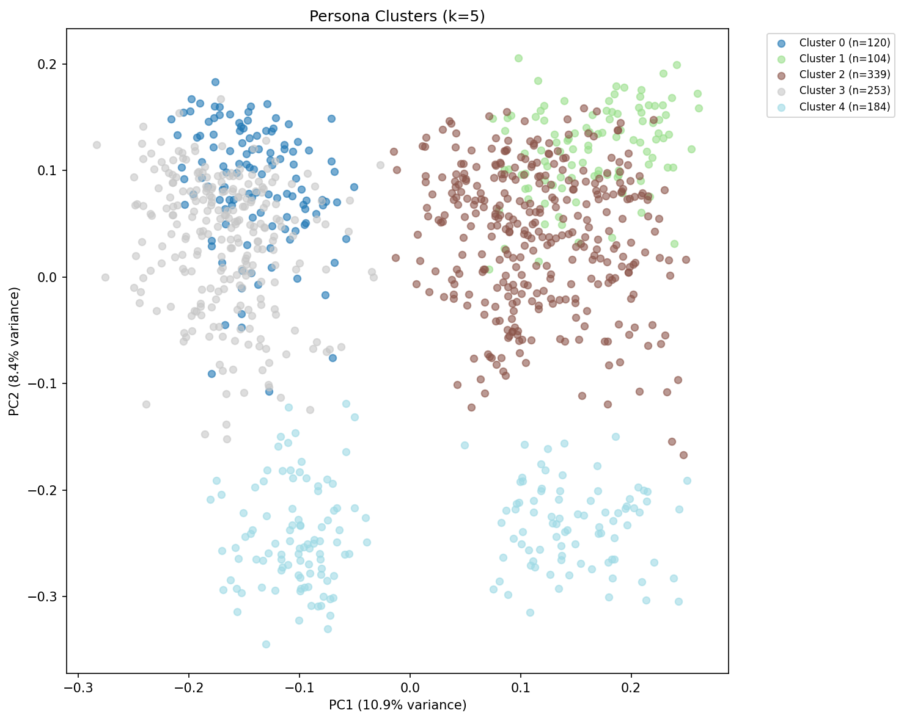
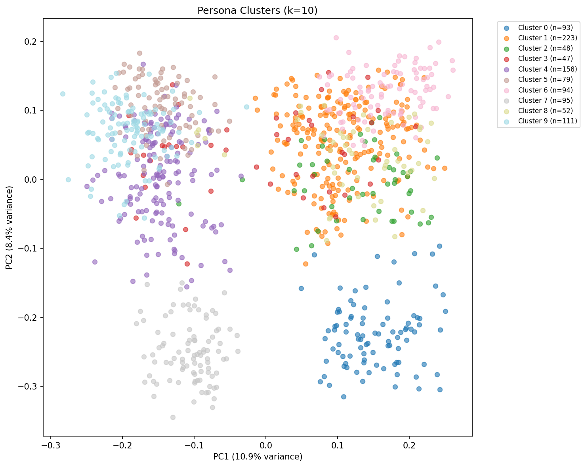
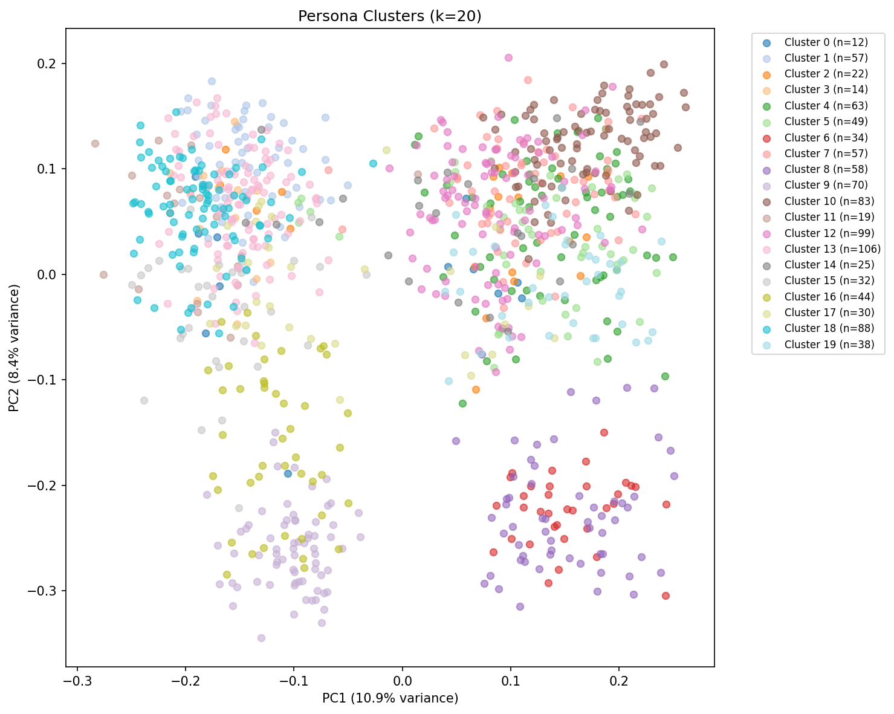

# Persona Clustering Analysis

Generated: 2026-01-21 22:40:34

## Summary

- **Total personas**: 1000
- **Embedding model**: text-embedding-3-small
- **Embedding dimensions**: 1536
- **Clustering algorithm**: K-Means
- **K values tested**: [5, 10, 20]

### Enhanced Stats (K=5)

| Cluster | Size | Avg Age | Age Bracket | % Female | Top Race | Politics | Ideology | Religion | Avg Income | Income IQR | Summary |
|---------|------|---------|-------------|----------|----------|----------|----------|----------|------------|------------|---------|
| 0 | 120 | 65 | 70-79 (28%) | 0% | White (68%) | Democrat (38%) | Conservative (38%) | Protestant (33%) | $114K | Q1: $39K, Q3: $151K | Older married men, retired or late-career public-sector professionals, moderate mixed-partisan |
| 1 | 104 | 76 | 70-79 (37%) | 100% | White (82%) | Democrat (44%) | Liberal (38%) | Unaffiliated (29%) | $90K | Q1: $20K, Q3: $88K | Older mostly White retired women, ex education/healthcare, moderate-liberal Democrats |
| 2 | 339 | 44 | 40-49 (21%) | 100% | White (60%) | Democrat (53%) | Liberal (36%) | Protestant (32%) | $122K | Q1: $50K, Q3: $153K | Adult-to-older women in education and healthcare, mostly center-left Democrats |
| 3 | 253 | 43 | 30-39 (25%) | 1% | White (61%) | Democrat (32%) | Conservative (32%) | Protestant (30%) | $121K | Q1: $55K, Q3: $158K | Married working-age men in blue-collar ops, mostly conservative or libertarian |
| 4 | 184 | 10 | 10-19 (52%) | 46% | White (43%) | N/A (27%) | Not applicable (25%) | Protestant (32%) | $38K | Q1: $0K, Q3: $36K | School-aged boys and girls dependents, students, mostly liberal-leaning |

### Enhanced Stats (K=10)

| Cluster | Size | Avg Age | Age Bracket | % Female | Top Race | Politics | Ideology | Religion | Avg Income | Income IQR | Summary |
|---------|------|---------|-------------|----------|----------|----------|----------|----------|------------|------------|---------|
| 0 | 93 | 11 | 10-19 (60%) | 100% | White (52%) | N/A (24%) | Not applicable (23%) | Protestant (30%) | $28K | Q1: $0K, Q3: $42K | Liberal-leaning female child and teen students not in the labor force |
| 1 | 223 | 45 | 50-59 (20%) | 100% | White (75%) | Democrat (55%) | Liberal (39%) | Protestant (31%) | $127K | Q1: $47K, Q3: $157K | Mid-career to older White women in healthcare/education, center-left Democrats |
| 2 | 48 | 48 | 50-59 (27%) | 98% | Multiracial (48%) | Democrat (33%) | Liberal (21%) | Catholic (38%) | $91K | Q1: $40K, Q3: $123K | Working-age Hispanic/Latina women in service or homemaking roles, mostly Democratic-leaning |
| 3 | 47 | 46 | 40-49 (26%) | 55% | Asian Indian (17%) | Democrat (38%) | Liberal (30%) | Protestant (30%) | $133K | Q1: $64K, Q3: $178K | Middle-aged Asian immigrant professionals in tech/healthcare, mostly liberal Democrats |
| 4 | 158 | 39 | 30-39 (28%) | 0% | White (46%) | Democrat (46%) | Liberal (33%) | Protestant (28%) | $122K | Q1: $52K, Q3: $157K | Working-age men in blue-collar and some high-income jobs, center-left leaning |
| 5 | 79 | 72 | 70-79 (38%) | 0% | White (73%) | Republican (43%) | Conservative (43%) | Protestant (34%) | $105K | Q1: $33K, Q3: $111K | Older mostly White retired/professional men, center-right Republican leaning |
| 6 | 94 | 76 | 70-79 (36%) | 100% | White (87%) | Democrat (40%) | Liberal (38%) | Unaffiliated (31%) | $93K | Q1: $20K, Q3: $92K | Older mostly White retired women ex-education/healthcare, Democratic-leaning |
| 7 | 95 | 10 | 10-19 (49%) | 0% | White (39%) | N/A (28%) | Not applicable (26%) | Protestant (34%) | $50K | Q1: $0K, Q3: $42K | Male under-18 students in family households, mostly liberal-leaning |
| 8 | 52 | 46 | 40-49 (29%) | 88% | White (71%) | Democrat (77%) | Liberal (44%) | Protestant (42%) | $122K | Q1: $60K, Q3: $159K | Middle-aged mostly female school workers, college-educated, strongly liberal Democrats |
| 9 | 111 | 50 | 60-69 (28%) | 1% | White (89%) | Republican (56%) | Conservative (58%) | Protestant (31%) | $118K | Q1: $62K, Q3: $151K | Middle-aged to older white men in skilled trades, strongly conservative Republican-leaning |

### Enhanced Stats (K=20)

| Cluster | Size | Avg Age | Age Bracket | % Female | Top Race | Politics | Ideology | Religion | Avg Income | Income IQR | Summary |
|---------|------|---------|-------------|----------|----------|----------|----------|----------|------------|------------|---------|
| 0 | 12 | 42 | 30-39 (42%) | 50% | Asian Indian (92%) | Liberal (58%) | Liberal (50%) | Protestant (50%) | $112K | Q1: $47K, Q3: $176K | Married South Asian adult professionals in tech/education, liberal-leaning |
| 1 | 57 | 73 | 70-79 (32%) | 0% | White (70%) | Republican (49%) | Conservative (49%) | Protestant (35%) | $69K | Q1: $25K, Q3: $90K | Older mostly White retired men leaning conservative Republican |
| 2 | 22 | 59 | 70-79 (36%) | 77% | White (59%) | Democrat (82%) | Liberal (82%) | Catholic (27%) | $144K | Q1: $39K, Q3: $149K | Older mostly White female artists or arts professionals, retired/freelance, liberal Democrats |
| 3 | 14 | 47 | 40-49 (50%) | 0% | White (57%) | Republican (64%) | Conservative (64%) | Unaffiliated (43%) | $112K | Q1: $51K, Q3: $145K | Middle-aged male public safety and security workers, strongly conservative Republican |
| 4 | 63 | 46 | 40-49 (22%) | 100% | White (76%) | Democrat (49%) | Liberal (35%) | Protestant (40%) | $81K | Q1: $30K, Q3: $112K | Mostly White female service and small-business workers, mixed-age, Democrat-leaning with conservative wing |
| 5 | 49 | 45 | 40-49 (31%) | 90% | White (73%) | Democrat (78%) | Liberal (43%) | Protestant (41%) | $125K | Q1: $64K, Q3: $157K | Mid-career to older female education workers, strongly liberal Democrats |
| 6 | 34 | 6 | 0-9 (100%) | 100% | White (59%) | N/A (71%) | Not applicable (71%) | Catholic (26%) | $0K | Q1: $0K, Q3: $0K | Young female children students/preschoolers with no occupation, no political leaning |
| 7 | 57 | 47 | 50-59 (28%) | 96% | White (60%) | Democrat (47%) | Conservative (18%) | Catholic (26%) | $134K | Q1: $58K, Q3: $185K | Middle-aged women healthcare workers leaning Democratic or progressive |
| 8 | 58 | 14 | 10-19 (97%) | 100% | White (50%) | N/A (16%) | Liberal (16%) | Protestant (34%) | $30K | Q1: $0K, Q3: $48K | Female student children and teens ages 8 to 18 with progressive leanings |
| 9 | 70 | 8 | 0-9 (64%) | 0% | White (43%) | N/A (39%) | Not applicable (36%) | Protestant (31%) | $14K | Q1: $0K, Q3: $2K | US-born male children in school households, politics mostly undeveloped with slight social justice leanings |
| 10 | 83 | 77 | 70-79 (34%) | 100% | White (87%) | Democrat (39%) | Liberal (36%) | Unaffiliated (31%) | $97K | Q1: $20K, Q3: $88K | Older mostly White retired women from education/healthcare, liberal-leaning |
| 11 | 19 | 42 | 40-49 (26%) | 5% | White (79%) | Democrat (37%) | Liberal (32%) | Protestant (37%) | $111K | Q1: $60K, Q3: $134K | Middle-aged male transportation workers, truck/taxi drivers, libertarian-leaning conservatives |
| 12 | 99 | 47 | 50-59 (21%) | 100% | White (81%) | Democrat (61%) | Liberal (47%) | Protestant (33%) | $142K | Q1: $64K, Q3: $170K | White female young-to-senior educated white-collar professionals, center-left Democrats |
| 13 | 106 | 51 | 50-59 (24%) | 0% | White (72%) | Democrat (46%) | Liberal (33%) | Protestant (34%) | $172K | Q1: $76K, Q3: $198K | Middle-aged to older White US-born professional men, center-left with GOP minority |
| 14 | 25 | 49 | 40-49 (36%) | 80% | Vietnamese alone (24%) | Democrat (32%) | Liberal (24%) | Protestant (28%) | $134K | Q1: $62K, Q3: $175K | Middle-aged to elderly Asian immigrant women in service/healthcare jobs, Democratic leaning |
| 15 | 32 | 39 | 30-39 (34%) | 3% | Other (53%) | Democrat (28%) | Progressive (12%) | Protestant (31%) | $105K | Q1: $46K, Q3: $124K | Spanish-speaking Latino men 20–60 in blue-collar logistics, moderate left-leaning |
| 16 | 44 | 20 | 10-19 (59%) | 0% | Black (34%) | Democrat (41%) | Liberal (43%) | Unaffiliated (30%) | $65K | Q1: $9K, Q3: $64K | Young male students and low-wage workers, mostly liberal Democrats |
| 17 | 30 | 33 | 20-29 (37%) | 33% | White (47%) | Democrat (40%) | Liberal (37%) | Protestant (37%) | $107K | Q1: $30K, Q3: $153K | Young mixed-gender food service workers leaning liberal Democrat |
| 18 | 88 | 48 | 60-69 (28%) | 1% | White (84%) | Republican (61%) | Conservative (64%) | Protestant (27%) | $94K | Q1: $51K, Q3: $106K | Middle-aged to older male blue-collar tradesmen conservative Republican libertarian-leaning |
| 19 | 38 | 47 | 40-49 (32%) | 100% | Multiracial (47%) | Democrat (32%) | Liberal (21%) | Catholic (39%) | $94K | Q1: $40K, Q3: $125K | Adult Hispanic/Latina women in service/care work, mostly Democratic-leaning |

## K=5 Clusters

| Cluster | Size | Description | Representative Persona |
|---------|------|-------------|------------------------|
| 0 | 120 | This cluster is dominated by older, married men (often empty‑nest/child‑free households), mostly White with some Black and immigrant/naturalized members, who are retired or late‑career professionals—especially from education, government/public service, and other credentialed fields—with generally stable or high incomes and near‑universal health insurance but a notable prevalence of disability. Politically they skew moderate-to-partisan (a mix of Democrats/liberals and Republicans/conservatives, with a visible environmentalist/Green streak), and their lifestyle is distinctly community- and nature-oriented (gardening, bird‑watching, volunteering, reading/arts, and “quiet” home-centered routines) with strong civic/education and conservation themes. | age: 66 / sex: Male / race: White alone / occupation category: Not applicable / political views: Republican / religion: Religiously Unaffiliated |
| 1 | 104 | This cluster is dominated by older, mostly White women (often Irish/European ancestry) who are retired or out of the labor force, frequently widowed/divorced and living alone or in two-person households, with many having disabilities but generally insured. Politically they skew moderate-to-liberal Democrats with a sizable conservative Republican minority, and their lifestyle is quiet, home- and community-centered—gardening, reading/knitting, church or volunteering—often reflecting former careers in education or healthcare. | age: 81 / sex: Female / race: White alone / political views: Republican / religion: Other Christian |
| 2 | 339 | This cluster is overwhelmingly **female** and skews **adult to older (30s–70s)**, with many **married** women (often with children) alongside a notable share of **divorced/widowed**; it’s also relatively **immigrant-/multilingual-heavy** (Spanish and Asian languages common) spanning White, Hispanic/Latina, and Asian backgrounds. Politically, they lean **center-left (Democrat/liberal/progressive)** with a smaller but visible **conservative/Republican** minority, and their lifestyles center on **people-facing service and care work** (education and healthcare dominate, plus admin/retail), with frequent themes of **community involvement, family focus, and health/wellness habits** (yoga, gardening, outdoors, eco-consciousness). | age: 44 / sex: Female / race: White alone / occupation category: SAL-First-Line Supervisors Of Retail Sales Workers / political views: Democrat / religion: Protestant |
| 3 | 253 | This cluster is overwhelmingly **male, mostly U.S.-born (often White but with a sizable immigrant/Spanish-speaking Hispanic component), and heavily concentrated in blue‑collar/operations work**—construction trades, trucking/warehousing, auto repair/manufacturing, plus a smaller but notable slice of higher‑income tech/engineering and a few professional roles—typically living **married and family‑oriented, hands‑on, outdoorsy/DIY and car‑centric lifestyles**. Politically, they skew **right-of-center (Republican/conservative or libertarian)** with a meaningful minority of **Democrats/progressives**, and religion is most often **Christian (Catholic/Protestant) or unaffiliated**, with many showing a pragmatic interest in **gadgets/technology** regardless of job type. | age: 49 / sex: Male / race: White alone / occupation category: CON-Electricians / political views: Independent / religion: Religiously Unaffiliated |
| 4 | 184 | This cluster is overwhelmingly made up of children and teenagers (mostly school-aged dependents) living in family households—often married-couple homes—with a notably diverse racial/ethnic mix and a strong presence of Spanish-speaking Hispanic or mixed-heritage families alongside White/Irish and other immigrant-origin backgrounds. Lifestyle-wise they skew toward active, social, school-centered routines with lots of creative hobbies (drawing, music, cooking, sports, tech/gadgets), and when politics is expressed (mostly by older teens/young adults) it leans more liberal/progressive/Democratic than conservative, with religion commonly Protestant/Catholic or unaffiliated. | age: 10 / sex: Male / race: Two or More Races / occupation category: Not Applicable / political views: Too young to have political views / religion: Catholic |

## K=10 Clusters

| Cluster | Size | Description | Representative Persona |
|---------|------|-------------|------------------------|
| 0 | 93 | This cluster is overwhelmingly **female children and teens (mostly ages ~2–17, a few young adults)** who are **students and not in the labor force**, typically living in **family households (often married-couple families, with a notable minority of single-mother households)** with generally **low/no personal income** and widespread **health insurance coverage**. Demographically it’s **racially and linguistically mixed** (many White plus sizable Hispanic/Spanish-speaking and some Asian/Black/multiracial), and where politics shows up it **tilts liberal/progressive/environmentalist**, with lifestyles centered on **school, family, and youthful creative hobbies (drawing/reading/music), outdoor activity, and occasional part-time service/childcare jobs for older teens**. | age: 8 / sex: Female / race: White alone / occupation category: Not applicable / political views: Not applicable / religion: Other Non-Christian Religion |
| 1 | 223 | This cluster is overwhelmingly **female and largely White (often Irish/German ancestry)**, spanning a wide age range but skewing **mid‑career to older**, with many **married households (often with kids or empty‑nesters)** and a notable slice of **immigrants/naturalized citizens**. Politically they lean **center‑left (Democrat/liberal/progressive)** with a smaller conservative Republican contingent, and their lifestyles center on **service and care work (especially healthcare/education/admin), community involvement, and health‑conscious routines** (yoga, gardening, volunteering, outdoors), with frequent creative/intellectual hobbies (reading, crafts, art). | age: 44 / sex: Female / race: White alone / occupation category: SAL-First-Line Supervisors Of Retail Sales Workers / political views: Democrat / religion: Protestant |
| 2 | 48 | This cluster is dominated by Hispanic/Latina women—often Spanish-speaking and frequently Mexico-born or naturalized—who are centered on family and community, with many working in service, retail, healthcare, or homemaking roles and a noticeable mix of lower formal education alongside a smaller slice of high-earning professionals. Politically they lean Democratic/liberal or progressive (often pro–immigrant/worker and social-services oriented) but include a meaningful conservative/Republican minority, and their lifestyle is typically busy, practical, and tradition-tinged (Catholic/Christian, cooking/gardening/volunteering, child-focused routines), sometimes with limited insurance and non-citizen status shaping daily life. | age: 49 / sex: Female / race: Some Other Race alone / political views: Non-partisan / religion: Catholic |
| 3 | 47 | This cluster is dominated by middle‑aged, married, family‑oriented immigrants and first/second‑generation Asian Americans (especially Vietnamese, Indian, Chinese, and Korean) who often speak an Asian/heritage language at home and are concentrated in skilled professional/technical and healthcare roles (IT/software/security, medicine/pharmacy, accounting) alongside a smaller but notable restaurant/retail small‑business segment. Politically they lean strongly liberal/Democrat (with a minority conservative/Republican), and their lifestyles skew busy, work‑and‑family centered, health‑conscious (yoga/Tai Chi/gardening/outdoors), and community‑minded, with generally high educational attainment and relatively high incomes but wide dispersion. | age: 31 / sex: Female / race: All combinations of Asian races only / occupation category: OFF-Production, Planning, And Expediting Clerks / political views: Liberal, advocating for social equality ... |
| 4 | 158 | This cluster is overwhelmingly male and working‑age, with a notable mix of White and Hispanic/Spanish‑speaking (often immigrant or naturalized) men alongside Black Americans, and it spans both blue‑collar logistics/construction/food‑service roles and a smaller but visible slice of high‑income professionals (law, tech, healthcare, government/security). Politically they tilt center‑left overall (many Democrats/“liberal” and some Greens), but with a meaningful conservative/Republican public‑safety and high‑earning professional contingent; lifestyles are generally active and practical—family‑oriented for married parents, tech/gadget‑curious, and frequently outdoorsy or community‑involved even among lower‑income and uninsured members. | age: 33 / sex: Male / race: Some Other Race alone / occupation category: EAT-Waiters And Waitresses / political views: Democrat / religion: Protestant |
| 5 | 79 | This cluster is overwhelmingly older, U.S.-born men (mostly White, with a smaller Black and immigrant Hispanic presence), typically married and empty‑nest/childless, living on retirement or late‑career professional incomes with high health-insurance coverage and frequent disabilities. Politically they skew center-right Republican but include a sizable liberal/Democratic and environmentalist/Green minority; lifestyle is defined by quiet, home-and-community routines—gardening, bird‑watching, reading, volunteering, and light outdoor activity—often reflecting former careers in education, public service/military, finance, and other professional roles. | age: 66 / sex: Male / race: White alone / occupation category: Not applicable / political views: Republican / religion: Religiously Unaffiliated |
| 6 | 94 | This cluster is dominated by older, mostly White women (often Irish/European ancestry) who are retired or out of the labor force, frequently widowed/divorced and living alone or as part of an older married couple, with many having worked in education or healthcare and spending quiet time on home-centered hobbies like gardening, reading, knitting, and light volunteering. Politically they lean Democratic/liberal overall but include a sizable conservative Republican minority; religion is mixed but skews toward Protestant/Catholic or unaffiliated, and the lifestyle pattern is generally modest, community-oriented, and low-key with common age-related disabilities and heavy reliance on health insurance. | age: 81 / sex: Female / race: White alone / political views: Republican / religion: Other Christian |
| 7 | 95 | This cluster is overwhelmingly **male children and teens (mostly under 18)** living in **family households (often married-couple, sometimes single-parent/cohabiting)**, with a heavy tilt toward **White/Irish-ancestry kids** alongside a notable share of **Hispanic/Spanish-speaking and multiracial** families; most are **students with no personal income** and generally **insured** (with a few uninsured/disability cases). Lifestyle-wise they’re defined by **kid/teen activities**—school, video games, skateboarding/sports, drawing/reading/comics—and where political views appear (mainly among older teens/young adults) they skew **liberal/progressive/Democratic** with a smaller conservative/Republican minority, and religion is most commonly **Protestant or Catholic** with many **unaffiliated**. | age: 10 / sex: Male / race: Two or More Races / occupation category: Not Applicable / political views: Too young to have political views / religion: Catholic |
| 8 | 52 | This cluster is dominated by middle‑aged, mostly female, college‑educated school-sector workers (teachers, librarians, aides, administrators, and childcare staff), largely U.S.-born but with a noticeable immigrant/naturalized minority and some multilingual households; many are married and family-oriented, with a smaller share widowed/divorced or single. Politically they skew strongly liberal/Democrat/progressive, and their lifestyle centers on community involvement and “school + home” routines—reading/books, gardening, yoga/health habits, and frequent interest in nature/environmental sustainability—while religion is mixed (often Protestant/Catholic with a sizable unaffiliated segment). | age: 48 / sex: Female / race: White alone / occupation category: EDU-Elementary And Middle School Teachers / political views: Democrat / religion: Protestant |
| 9 | 111 | This cluster is dominated by white, male, middle‑aged to older Americans (often married, frequently with older kids or empty‑nest households) working in skilled trades and blue‑collar/industrial roles—especially construction, trucking/transportation, manufacturing, and auto-related jobs—with a strong hands‑on “fix/build/tinker” lifestyle centered on DIY projects, cars, tools, and outdoor activities. Politically they skew strongly conservative/Republican with a noticeable libertarian streak, tend to be Christian (often Protestant/Catholic) or unaffiliated, and show wide income dispersion from modest hourly work to very high earners in management/engineering/law, but with a consistent practical, work‑first, self‑reliant orientation. | age: 56 / sex: Male / race: White alone / occupation category: MGR-Other Managers / political views: Republican / religion: Catholic |

## K=20 Clusters

| Cluster | Size | Description | Representative Persona |
|---------|------|-------------|------------------------|
| 0 | 12 | This cluster is dominated by South Asian–born (mostly Indian, plus some Pakistani/Yemeni) adults, often naturalized or non-citizens, highly educated (many master’s/doctorates) and concentrated in tech/IT, education, and other professional roles, typically in married households (frequently with children) with generally solid incomes and health coverage. Politically they skew strongly liberal/Democrat/progressive, and their lifestyles are busy, family- and achievement-oriented with a noticeable “knowledge-worker” vibe (tech/gadgets, research/teaching, yoga/cultural home life) and relatively low-extraversion, introspective personalities common among the younger professionals. | age: 36 / sex: Male / race: Asian Indian alone / occupation category: CMM-Information Security Analysts / political views: Democrat / religion: Other Christian |
| 1 | 57 | This cluster is dominated by older men (mostly 60s–90s), largely White with a notable Spanish-speaking/Hispanic minority, who are mostly retired/not in the labor force, often married without children at home, and frequently veterans and/or living with disabilities but generally insured. Politically they lean conservative/Republican overall (with a sizable liberal/Democrat and small Green/environmentalist wing), and their lifestyle skews quiet and home- or community-centered—gardening, reading, volunteering, tinkering with gadgets/woodworking, and nature/outdoor hobbies. | age: 66 / sex: Male / race: White alone / occupation category: Not applicable / political views: Republican / religion: Religiously Unaffiliated |
| 2 | 22 | This cluster is dominated by older, mostly White women (with a few Black/multiracial and immigrant members) who are artists or arts-adjacent professionals—often retired or freelance—with generally moderate-to-high education, mixed incomes, and household structures skewing toward married-without-kids or living alone/widowed. Politically they are overwhelmingly liberal/Democratic and lifestyle-wise they center creativity (painting/photography/music, carrying sketchbooks, community arts), with many living quietly/independently and a notable presence of disability/health-coverage in the older retirees. | age: 76 / sex: Female / race: White alone / occupation category: Artist / political views: Democrat / religion: Catholic |
| 3 | 14 | This cluster is dominated by middle‑aged men working in public safety and security—especially police, detectives, corrections, and related government roles (local/state/federal), with generally stable middle-to-upper incomes, health coverage, and family-oriented married households common. Politically they skew strongly conservative/Republican (with a smaller liberal/progressive minority), and their lifestyle centers on discipline, vigilance, fitness/outdoors, and community service, often paired with traditional or unaffiliated religion and a mostly White-but-not-monolithic racial mix. | age: 63 / sex: Male / race: White alone / occupation category: PRT-Detectives And Criminal Investigators / political views: Republican / religion: Other Christian |
| 4 | 63 | This cluster is overwhelmingly **female and largely White (often Irish/German ancestry)** spanning young adults to seniors, with many in **service/retail/caregiving roles** (cashiers, customer service, childcare, cosmetology) alongside a notable minority of **self-employed small-business owners**; households skew toward **married or single female-headed homes**, frequently with children or living alone later in life. Politically they lean **Democrat/Liberal overall but with a sizable Conservative/Republican wing**, and their lifestyle is distinctly **home-and-community centered**—heavy on **gardening, wellness/yoga, volunteering/church involvement, and eco/health-conscious habits** rather than nightlife or high-status consumption. | age: 44 / sex: Female / race: White alone / occupation category: SAL-First-Line Supervisors Of Retail Sales Workers / political views: Democrat / religion: Protestant |
| 5 | 49 | This cluster is dominated by mid‑career to older, mostly female and largely White (with some Asian, Black, Hispanic, and multiracial members) education workers—especially K‑12 teachers, librarians, and school administrators—often in local/state government or nonprofits, with relatively high education (many master’s degrees) and generally stable, insured, married/parent family lives. Politically they skew strongly liberal/progressive and Democratic, and their lifestyle centers on community involvement plus “teacherly” hobbies (reading, gardening, volunteering) with a noticeable bent toward wellness and environmental sustainability (hiking, yoga, reusable bottles, nature activities). | age: 48 / sex: Female / race: White alone / occupation category: EDU-Elementary And Middle School Teachers / political views: Democrat / religion: Protestant |
| 6 | 34 | This cluster is overwhelmingly **young female children (ages ~2–9)**—students or preschoolers with **no income or employment**—mostly **U.S.-born**, living primarily in **two-parent married households** (with a smaller share in single-parent or cohabiting families) and generally **insured**. Demographically they skew **White with notable multiracial, Black, and Hispanic/Spanish-speaking representation**, are **too young for political ideology**, and share a kid-centric lifestyle centered on **play, drawing/storytelling, and outdoor activities**, with religions reflecting their families (often **Christian—Catholic/Protestant—plus some unaffiliated and a few non-Christian faiths**). | age: 7 / sex: Female / race: Two or More Races / occupation category: Not applicable / political views: Not applicable / religion: Other Christian |
| 7 | 57 | This cluster is dominated by women (mostly ages 30–65, skewing middle‑aged) working in healthcare and healthcare-adjacent roles—especially nurses, nursing assistants, medical assistants, pharmacy techs, and hospital/admin support—often with steady employment and health insurance, and family structures that are frequently married (often with children) or divorced/widowed and living alone. Politically they lean Democratic/liberal or progressive overall (with a noticeable conservative/Republican minority), and their lifestyles commonly center on health/wellness routines (gardening, yoga, volunteering/community involvement) and practical, service-oriented daily life. | age: 26 / sex: Female / race: White alone / occupation category: MED-Registered Nurses / political views: Democrat / religion: Religiously Unaffiliated |
| 8 | 58 | This cluster is overwhelmingly **female children/teens (roughly ages 8–18)** who are **students living with parents in family households**, with **no personal income and little/no employment** aside from a few part-time service/childcare jobs. Demographically they’re **racially and culturally mixed (notably White, Hispanic/Spanish-speaking, and several Asian backgrounds)**, and lifestyle-wise they skew **active and school-centered with creative hobbies (drawing/reading/music), some tech/gadget interest and environmental/social-justice leanings**, while politics are mostly **undeveloped due to age but often tilt progressive/liberal** where expressed. | age: 13 / sex: Female / race: White alone / occupation category: Not applicable / political views: Too young to vote but leans towards progressive values / religion: Religiously Unaffiliated |
| 9 | 70 | This cluster is overwhelmingly **male children (toddlers through early teens, mostly U.S.-born)** living in **family households** (often married-couple homes, with a notable minority in single-mother homes), with **English-only or Spanish-speaking** households and a **racial mix skewing White with many Hispanic/multiracial kids**.  Lifestyle is defined by **school and play**—video games, drawing, superheroes/toy cars, sports/skateboarding—with **religion often Christian (Catholic/Protestant)** and **politics largely not formed/too young**, aside from occasional early “fairness/social justice” leanings. | age: 10 / sex: Male / race: Two or More Races / occupation category: Not Applicable / political views: Too young to have political views / religion: Catholic |
| 10 | 83 | This cluster is dominated by older, mostly White women (often Irish/European ancestry) who are retired from education or healthcare, frequently widowed or married without children at home, and living quiet, home-centered lives built around gardening, reading, knitting, bird-watching, and community volunteering. Politically they skew liberal/Democratic with a sizeable conservative/Republican minority, and they tend to be religiously unaffiliated or mainstream Christian/Catholic, with many managing age-related disabilities while remaining community- and nature-oriented. | age: 81 / sex: Female / race: White alone / political views: Republican / religion: Other Christian |
| 11 | 19 | This cluster is dominated by working- and middle-class transportation workers—especially truck drivers, taxi/chauffeur drivers, warehouse/freight handlers, and a few related roles (dispatcher, mechanic, pilot)—who are mostly men, often divorced or married with kids, and include a notable immigrant/Spanish-speaking slice (especially Mexican-born/non‑citizens) alongside mostly U.S.-born White Midwestern/Southern profiles. Politically they lean libertarian-to-conservative (with a meaningful liberal/progressive minority), and their lifestyles are practical and road/work-centered—hands-on vehicle hobbies, country/sports/community time, and generally simple, independent routines with mixed access to benefits/insurance (some uninsured among self-employed/immigrant drivers). | age: 55 / sex: Male / race: White alone / occupation category: TRN-Driver/Sales Workers And Truck Drivers / political views: Democrat / religion: Other Non-Christian Religion |
| 12 | 99 | This cluster is overwhelmingly **female and predominantly White (often Irish/European ancestry), spanning young adults to seniors**, with many **married households** (either raising school‑age kids or “empty nesters”), plus a notable share of **divorced/widowed women living alone**. They skew **center‑left politically (mostly Democrats/liberals/progressives, with a smaller conservative Republican minority)** and tend to be **educated, white‑collar/service professionals** (finance, legal, government/admin, tech, nonprofit), with lifestyles that emphasize **reading/intellectual hobbies, community/volunteering, and health‑and‑wellness routines (yoga, fitness, eco‑conscious habits)**. | age: 57 / sex: Female / race: White alone / occupation category: BUS-Management Analysts / political views: Democrat / religion: Catholic |
| 13 | 106 | This cluster is dominated by U.S.-born, mostly White men spanning midlife to older ages, typically married and financially comfortable, with high educational attainment and careers in professional/managerial, tech/engineering, finance, law, government/education, and other skilled roles. Politically they skew center-left (Democrat/liberal) but include a sizable conservative Republican minority; lifestyle-wise they’re notably “active-but-intellectual” types—tech/gadget-oriented, outdoorsy (hiking/bird-watching), and engaged in culture/learning (reading, music, art), often with stable, health-insured households. | age: 60 / sex: Male / race: White alone / occupation category: CMM-Software Developers / political views: Democrat / religion: Religiously Unaffiliated |
| 14 | 25 | This cluster is dominated by Asian and Pacific Islander immigrants or children of immigrants (especially Vietnamese, Korean, Chinese, and Filipino), skewing female and spanning middle-aged to elderly, with many married, family-centered households and frequent use of non‑English home languages alongside naturalized U.S. citizenship. They tend to be steadily employed in practical, service/healthcare, government, retail, and light manufacturing roles (with a few high-earning professionals), live relatively traditional/community-oriented lifestyles, and politically lean more Democratic/liberal overall (though with a notable conservative/traditional minority), often paired with Christian affiliation and strong ties to cultural traditions (food, music, gardening, and community service). | age: 31 / sex: Female / race: All combinations of Asian races only / occupation category: OFF-Production, Planning, And Expediting Clerks / political views: Liberal, advocating for social equality ... |
| 15 | 32 | This cluster is overwhelmingly Spanish-speaking Hispanic/Latino (especially Mexican/Central American) adults—mostly men in their 20s–60s, often foreign-born or naturalized—who are working or self-employed in hands-on, blue-collar and logistics fields like construction, landscaping, warehousing/transportation, couriers, auto repair, and manufacturing, with strong family orientation and community ties. Politically they skew pragmatic/moderate with a noticeable Democratic/left-leaning tilt around workers’ and immigrant rights (alongside some conservatives/independents), and lifestyle patterns emphasize hard work, outdoors/fitness, and religion that is often Catholic or Protestant, with uneven access to health insurance. | age: 55 / sex: Male / race: Some Other Race alone / occupation category: CON-Construction Laborers / political views: Republican / religion: Protestant |
| 16 | 44 | This cluster is overwhelmingly **male and very young (mostly teens/early‑20s)**, racially diverse with a strong presence of **Black/African American and Hispanic/Spanish-speaking backgrounds**, often **students or in low-wage/retail/warehouse/service work** and frequently **not in the labor force**, with mixed access to health insurance. Politically they skew **left-of-center (liberal/progressive, usually Democrat)** with a lifestyle that’s **active, social, and community/creative-oriented** (sports, skateboarding, music/art/volunteering), alongside a smaller minority of conservatives/libertarians. | age: 17 / sex: Male / race: Two or More Races / occupation category: Not applicable / political views: Democrat / religion: Religiously Unaffiliated |
| 17 | 30 | This cluster is dominated by young-to-middle-aged service-industry workers—especially restaurant cooks, chefs, bartenders, servers, and food-service managers—often living alone or in small households, with a notable mix of immigrants/heritage diversity (Hispanic and Asian backgrounds alongside White Americans) and generally modest-to-variable incomes. Politically they skew left-of-center (liberal/Democrat, with some Green/Independent and a smaller conservative/Republican minority), and their lifestyle is distinctly food- and experience-centric (constant cooking/recipe experimentation, “foodie” culture), paired with active, outdoorsy, health/eco-conscious hobbies like hiking, fitness, and sustainability. | age: 21 / sex: Male / race: White alone / occupation category: EAT-Cooks / political views: Democrat / religion: Protestant |
| 18 | 88 | This cluster is dominated by middle‑aged to older men—mostly White with European (often Irish/German/Polish) roots, English-speaking, and typically married—working in blue‑collar and skilled‑trade jobs tied to construction, manufacturing, automotive, warehousing, and equipment repair, with practical, hands‑on hobbies like DIY projects, woodworking, cars, and outdoor activities. Politically they skew strongly conservative/Republican with a notable libertarian streak, tend to be religiously unaffiliated or Christian (often Catholic/Protestant), and generally live a frugal, work‑and‑family centered lifestyle with some pockets of lower insurance coverage and disability. | age: 56 / sex: Male / race: White alone / occupation category: MGR-Other Managers / political views: Republican / religion: Catholic |
| 19 | 38 | This cluster is dominated by Hispanic/Latina women—often Spanish-speaking and frequently foreign-born (especially Mexico and the Caribbean)—who are married or single mothers in family-centered households, working in or adjacent to service, retail, caregiving, and blue-collar roles (with a smaller but notable slice of high-earning, highly educated professionals). Politically they skew Democratic/liberal or progressive with some conservative/nonpartisan exceptions, and their lifestyle is defined by tight family/community ties, religious affiliation (especially Catholic/Christian), bilingual cultural identity, and practical day-to-day routines over status-driven consumption. | age: 49 / sex: Female / race: Some Other Race alone / political views: Non-partisan / religion: Catholic |

