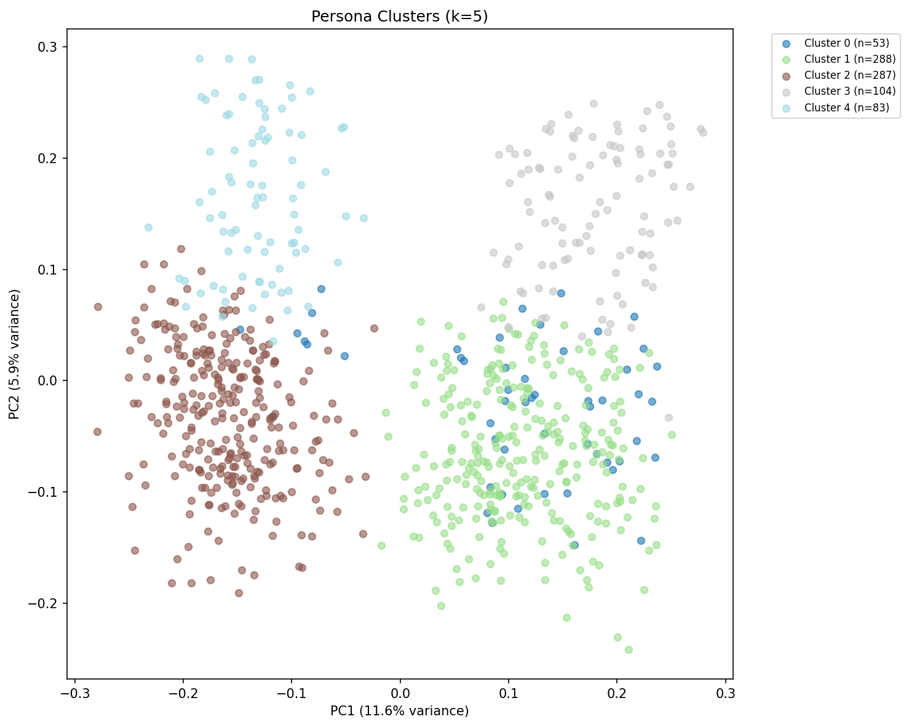
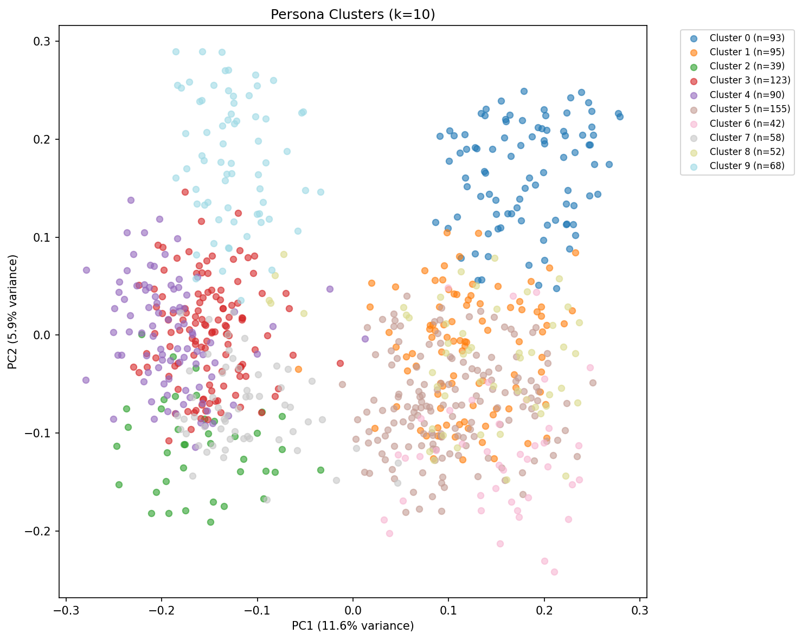
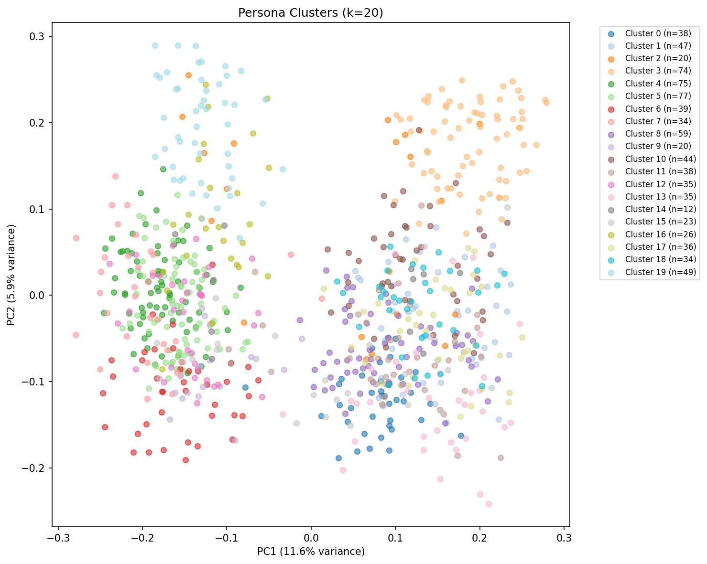

# Persona Clustering Analysis

Generated: 2026-01-21 22:48:17

## Summary

- **Total personas**: 815
- **Embedding model**: text-embedding-3-small
- **Embedding dimensions**: 1536
- **Clustering algorithm**: K-Means
- **K values tested**: [5, 10, 20]

## K=5 Clusters

| Cluster | Size | Description | Representative Persona |
|---------|------|-------------|------------------------|
| 0 | 53 | This cluster is dominated by middle‑aged, mostly female, largely White (with a notable mix of immigrant/naturalized Asian and Latino members) education workers—teachers, aides, librarians, and school/childcare administrators—often with bachelor’s/master’s degrees, stable health insurance, and generally middle‑to‑upper incomes, frequently married and either raising school‑age kids or in “empty‑nest” households. Politically they skew strongly Democrat/liberal/progressive (with a smaller conservative Republican minority), and their lifestyles center on community involvement and service-oriented routines—reading/learning, volunteering, gardening, yoga/fitness, and outdoors/environmental sustainability themes—often tied back into their work in schools. | age: 43 / sex: Female / race: White alone / occupation category: EDU-Elementary And Middle School Teachers / political views: Democrat / religion: Protestant |
| 1 | 288 | This cluster is overwhelmingly **female** and spans a wide age range but skews **working-age to older (30s–60s)**, with many **married** women (often with children) alongside a notable share of divorced/widowed women living alone; it is also **ethnically diverse** with a strong presence of **White (often Irish/German)** plus many **immigrants/Spanish- or Asian-language households** (Latina, East/South Asian, Caribbean). Politically, the group **leans strongly liberal/Democrat** (with a smaller conservative/Republican minority), and lifestyle-wise they are **work- and family-centered**, concentrated in **healthcare, administrative/clerical, retail/service, and some professional/managerial roles**, with common interests in **health/wellness (yoga, gardening), community involvement/volunteering, and practical, routine-oriented living**. | age: 44 / sex: Female / race: White alone / occupation category: SAL-First-Line Supervisors Of Retail Sales Workers / political views: Democrat / religion: Protestant |
| 2 | 287 | This cluster is dominated by men across a wide age range (often 30s–60s), disproportionately White but with a notable mix of Hispanic/Spanish-speaking and immigrant backgrounds, and many are married with family-oriented households. They skew culturally traditional and pragmatic—heavy representation in hands-on or operational work (construction/trades, transportation/logistics, manufacturing, public safety, and some tech/engineering), with lifestyles centered on steady work, DIY/gadgets, cars/outdoors, and community/family; politically they lean center-right overall (many Republican/conservative or libertarian) with a sizable Democratic/progressive minority, and religion is commonly Christian/Catholic or unaffiliated. | age: 60 / sex: Male / race: White alone / occupation category: CMM-Software Developers / political views: Democrat / religion: Religiously Unaffiliated |
| 3 | 104 | This cluster is dominated by older, mostly retired women (often widowed/divorced and living alone or as empty‑nest married couples), predominantly White with some immigrant/Spanish- or Asian-language households, and many have disabilities but generally maintain health coverage. Politically they skew Democrat/liberal overall (with a sizable conservative/Republican minority), and their lifestyle is quiet, home- and community-centered—gardening, reading, knitting/crafts, bird-watching, church/volunteering—reflecting former careers in education and healthcare. | age: 81 / sex: Female / race: White alone / political views: Republican / religion: Other Christian |
| 4 | 83 | This cluster is dominated by older men (mostly 60s–90s), largely White with some Black and Hispanic/immigrant representation (including Spanish-speaking households), who are mostly retired/not in the labor force, often married without children at home, frequently veterans, and commonly managing disabilities while still insured. Politically they skew conservative/Republican but include a notable liberal/Democrat and environmentalist/Green Party minority; lifestyle-wise they’re distinctive for quiet, home-and-community-centered routines with strong “nature + hobbies” patterns (gardening, bird-watching, reading, painting/woodworking, volunteering) and a recurring interest in gadgets/technology despite age. | age: 66 / sex: Male / race: White alone / occupation category: Not applicable / political views: Republican / religion: Religiously Unaffiliated |

## K=10 Clusters

| Cluster | Size | Description | Representative Persona |
|---------|------|-------------|------------------------|
| 0 | 93 | This cluster is dominated by older, mostly White women (often of Irish/European ancestry) who are retired or out of the labor force, frequently widowed/divorced and living alone or as empty-nesters, with many having past careers in education or healthcare and spending quiet time on home-and-community hobbies like gardening, reading, knitting, birdwatching, and volunteering. Politically they skew moderate-to-liberal/Democratic overall but include a sizable conservative/Republican minority, with religion often Catholic/Protestant or unaffiliated and a generally frugal, low-key, community-oriented retirement lifestyle. | age: 81 / sex: Female / race: White alone / political views: Republican / religion: Other Christian |
| 1 | 95 | This cluster is dominated by women—often middle‑aged to older—who are steadily employed in healthcare and adjacent human‑services/administrative roles (nurses, aides, medical assistants/techs, pharmacy, HR/clerical), typically English-speaking, frequently White with a notable mix of Black and immigrant Asian/Latina backgrounds, and commonly married or divorced with smaller/older-child households. Politically they lean Democratic/liberal overall but include a sizable conservative Republican slice; lifestyle patterns skew health- and community-oriented (gardening, volunteering, yoga/fitness, quiet home routines), with generally stable insurance coverage and a practical, work-centered day-to-day. | age: 61 / sex: Female / race: White alone / occupation category: MED-Registered Nurses / political views: Independent / religion: Religiously Unaffiliated |
| 2 | 39 | This cluster is overwhelmingly **Spanish-speaking Hispanic/Latino men (often Mexican/Central Caribbean origin, many foreign-born and some non‑citizens)** concentrated in **working- and middle‑income, hands-on jobs** like construction, transportation/warehousing, manufacturing, auto repair, and service work, with a strong tilt toward **married/family households** (often with children) and community- or church-linked routines. Politically they’re **mixed but center-left leaning overall** (Democrat/left-leaning or immigrant/workers’ rights sympathetic, alongside a notable conservative/Republican minority), and their lifestyle patterns emphasize **hard work, practicality, and family/community time** (soccer, gym/outdoors, church/volunteering), with **uneven access to health insurance** especially among non‑citizens and lower-education workers. | age: 55 / sex: Male / race: Some Other Race alone / occupation category: CON-Construction Laborers / political views: Republican / religion: Protestant |
| 3 | 123 | This cluster is dominated by middle‑aged to older married men (mostly White, with a notable share of immigrants/naturalized citizens) who are steadily employed in professional/managerial, tech/engineering, finance/legal, construction, or public‑safety/government roles, often with solid-to-high household incomes and health insurance. Politically they skew center-right overall (many Republicans/conservatives, with a sizable liberal/Democrat minority), and their lifestyle is distinctly “active-but-practical”—family/community oriented, health/fitness and outdoors (hiking/bird‑watching) are common, alongside a strong interest in technology/gadgets and structured, work-focused routines. | age: 60 / sex: Male / race: White alone / occupation category: CMM-Software Developers / political views: Democrat / religion: Religiously Unaffiliated |
| 4 | 90 | This cluster is dominated by middle‑aged to older, mostly White men (often Irish/German/Polish ancestry, English-speaking) working in blue-collar and skilled-trades roles tied to manufacturing, construction, trucking/warehousing, and auto sales/repair; they tend to be married or divorced, with many living in couple households (often with kids) and a practical, hands-on “garage/DIY” lifestyle centered on cars, tools, outdoors, and classic rock/country. Politically they skew strongly conservative/Republican with a noticeable libertarian streak (small-government/personal freedom), and religion is commonly Protestant/Catholic or unaffiliated, with relatively few strongly liberal outliers. | age: 30 / sex: Male / race: White alone / occupation category: TRN-Laborers And Freight, Stock, And Material Movers, Hand / political views: Republican / religion: Protestant |
| 5 | 155 | This cluster is overwhelmingly **female**, largely **White (often Irish/German ancestry)** but with a notable share of **immigrants and multilingual households** (Asian, Middle Eastern, Latin American origins), skewing **working-age to older** and frequently **married** (often with children) or living independently. Politically they lean **strongly liberal/Democrat** (with a smaller conservative/Republican minority), and their lifestyles center on **steady work in service/office/professional roles (including many self-employed)** plus **health/wellness, reading/creative hobbies, and community/family orientation**, with religion often **Catholic/Protestant or unaffiliated**. | age: 44 / sex: Female / race: White alone / occupation category: SAL-First-Line Supervisors Of Retail Sales Workers / political views: Democrat / religion: Protestant |
| 6 | 42 | This cluster is overwhelmingly **female and heavily Hispanic/Latina (often Mexican-origin), frequently Spanish-speaking and immigrant or naturalized**, spanning young mothers to older women, with many living in **married or single-mother, child-centered households**. Politically they **lean Democratic/progressive overall but include a notable conservative/Republican minority**, and their lifestyles skew **family- and community-oriented with work concentrated in service/healthcare/retail roles (or homemaking), strong Catholic/Christian affiliation, and generally practical, modest day-to-day routines**. | age: 49 / sex: Female / race: Some Other Race alone / political views: Non-partisan / religion: Catholic |
| 7 | 58 | This cluster is dominated by young-to-middle‑aged men (many in their late teens–30s), racially and immigrant-origin diverse (notably Black and Asian, with many foreign-born/naturalized and multilingual), who tend to work in service and shift-based roles—especially restaurants/food service (cooks, chefs, bartenders, servers) plus some logistics/retail—often living alone or in nontraditional households with uneven access to health insurance. Politically they skew strongly liberal/progressive and Democratic, with lifestyles that are active/social and creatively inclined (music, cooking/food experimentation, community volunteering/fitness), alongside a smaller conservative/traditionalist minority concentrated among some older/immigrant and military personas. | age: 33 / sex: Male / race: Some Other Race alone / occupation category: EAT-Waiters And Waitresses / political views: Democrat / religion: Protestant |
| 8 | 52 | This cluster is dominated by mid‑career to older, mostly female and largely White (with a notable mix of immigrants and multiracial members) education workers—especially K‑12 teachers, aides, librarians, and school administrators—often married and family‑oriented, with generally stable incomes and high rates of health insurance coverage. Politically they skew strongly liberal/progressive and Democratic, and their lifestyles center on community involvement and “helping professions,” with common interests in reading/learning, gardening, volunteering, and health/environmental habits (e.g., yoga, nature activities, sustainability). | age: 48 / sex: Female / race: White alone / occupation category: EDU-Elementary And Middle School Teachers / political views: Democrat / religion: Protestant |
| 9 | 68 | This cluster is dominated by older men (mostly 65–90+), largely White with a notable Spanish-speaking Hispanic minority and some Black members, who are mostly retired/not in the labor force, often married without children at home (or living alone if widowed/divorced), with frequent veteran history and disability but generally insured. Politically they lean Republican/conservative overall with a sizable Democrat/liberal wing (including a small but distinctive Green/environmentalist segment), and their lifestyle centers on quiet, home-and-community routines—gardening, reading, volunteering, and nature/outdoors—with many coming from education/public service/arts backgrounds and a mix of Christian (Catholic/Protestant) and unaffiliated religion. | age: 66 / sex: Male / race: White alone / occupation category: Not applicable / political views: Republican / religion: Religiously Unaffiliated |

## K=20 Clusters

| Cluster | Size | Description | Representative Persona |
|---------|------|-------------|------------------------|
| 0 | 38 | This cluster is dominated by young women (mostly late teens to late 20s, largely U.S.-born but with notable immigrant/heritage diversity and some bilingual Spanish/other-language households) working or studying in service/retail/administrative and arts/entertainment-adjacent roles, often unmarried and living alone/with roommates or in small households. Politically they skew strongly liberal/progressive and Democratic, with lifestyles that emphasize being active and social plus eco-/community-minded interests (volunteering, sustainability, wellness, arts/music), and religion is mixed but often Protestant/Catholic or unaffiliated. | age: 21 / sex: Female / race: Some Other Race alone / occupation category: SAL-Cashiers / political views: Democrat / religion: Religiously Unaffiliated |
| 1 | 47 | This cluster is dominated by middle‑aged, college‑educated women working in K–12 education and related support roles (teachers, aides, librarians, counselors, administrators), often as local/state government employees, with generally stable incomes and high rates of being married with children. Politically they skew strongly liberal/progressive and Democratic (with a small conservative/Republican minority), and their lifestyle centers on family/community involvement and “quiet” hobbies tied to learning and wellness—reading, gardening, volunteering, yoga, and outdoors/nature activities—alongside notable racial/immigrant diversity compared with many teacher-heavy groups. | age: 48 / sex: Female / race: White alone / occupation category: EDU-Elementary And Middle School Teachers / political views: Democrat / religion: Protestant |
| 2 | 20 | This cluster is dominated by older, mostly U.S.-born adults (often married or widowed, frequently living without children at home) whose lives center on the arts—many are retired or freelance artists/creatives with generally stable health insurance and a notable presence of disability in later life. Politically they are overwhelmingly liberal/Democrat/progressive, and lifestyle-wise they skew toward quiet-to-cultured, creativity-driven routines (painting, sketching, music, community arts), with religion often unaffiliated or mainstream Christian/Catholic rather than strongly traditional. | age: 76 / sex: Female / race: White alone / occupation category: Artist / political views: Democrat / religion: Catholic |
| 3 | 74 | This cluster is dominated by older, mostly White women (often of Irish/European ancestry) who are retired from education or healthcare and live in small households—frequently married without kids at home or widowed/divorced and living alone—with quiet, home-centered routines like gardening, reading, knitting, and volunteering. Politically they skew moderate-to-liberal/Democratic overall but include a sizeable conservative/Republican minority, and they tend to be lightly religious or unaffiliated (with some Catholic/Protestant presence) while managing age-related disability/health needs with generally stable insurance coverage. | age: 81 / sex: Female / race: White alone / political views: Republican / religion: Other Christian |
| 4 | 75 | This cluster is dominated by White, English-speaking men—often Irish/German ancestry—spanning mostly working-age to older adults, who work (or worked) in hands-on trades and industrial jobs like construction, electrical work, manufacturing, warehousing, mining, and related supervision/management, with generally middle to upper-middle incomes and a strong tilt toward married/family households. Politically they skew strongly conservative/Republican (with a noticeable libertarian streak and a small minority of moderates/liberals/greens), and their lifestyle is distinctly practical and outdoors/DIY-oriented—home improvement, woodworking, hunting/fishing/hiking, and community volunteering—paired with relatively traditional Christian affiliation or religious non-affiliation. | age: 56 / sex: Male / race: White alone / occupation category: MGR-Other Managers / political views: Republican / religion: Catholic |
| 5 | 77 | This cluster is dominated by middle‑aged to older, mostly married men (largely White but with a notable share of Asian/immigrant professionals) who are highly educated and concentrated in tech/engineering, government/security, and finance/management roles with generally high incomes and strong insurance coverage. Politically they skew moderate-to-liberal/Democratic with a sizable conservative/Republican minority, and lifestyle-wise they’re distinctive for being tech-and-gadget oriented while also health/outdoors focused (hiking, gardening, birdwatching), often with mainstream Christian/Catholic affiliation and a family- or community-centered routine. | age: 60 / sex: Male / race: White alone / occupation category: CMM-Software Developers / political views: Democrat / religion: Religiously Unaffiliated |
| 6 | 39 | This cluster is overwhelmingly **male, Spanish-speaking, Latino/Hispanic (especially Mexican plus Puerto Rican/Central American), and often immigrant or first‑generation**, spanning young adults to older workers, with many living in **married/cohabiting, child-present households**. They tend to work in **hands-on, blue-collar and service jobs** (construction, logistics/warehousing, couriers, auto repair, manufacturing, landscaping), show **mixed insurance coverage**, and politically lean **Democrat/left-leaning or Independent with pro–workers’/immigrant-rights instincts**, alongside a notable minority of **socially conservative/Republican** profiles; lifestyle-wise they’re **family- and community-oriented, active/outdoorsy**, and culturally tied to **Spanish-language traditions (music, food, church/community activities)**. | age: 55 / sex: Male / race: Some Other Race alone / occupation category: CON-Construction Laborers / political views: Republican / religion: Protestant |
| 7 | 34 | This cluster is dominated by working- and middle-class men (often White, middle-aged to older) tied to transportation and automotive work—truck drivers, mechanics, auto sales/repair, warehousing, and vehicle manufacturing—who live practical, hands-on lives centered on cars/trucks, DIY projects, and outdoor/community activities. Politically they skew conservative/Republican with a strong libertarian streak (and a smaller liberal/Democratic minority), and they tend to have modest-to-mixed education levels, family-oriented or solitary households, and relatively low religious intensity (many unaffiliated, otherwise Protestant/Catholic). | age: 55 / sex: Male / race: White alone / occupation category: TRN-Driver/Sales Workers And Truck Drivers / political views: Democrat / religion: Other Non-Christian Religion |
| 8 | 59 | This cluster is dominated by middle‑aged, mostly White women (often Irish/European ancestry, with a notable immigrant/Indo‑European–language subset) who are married and frequently raising school‑age children, with generally high education and solid-to-very-high household incomes tied to professional/managerial work in finance, real estate, admin/operations, and tech. Politically they skew strongly Democratic/liberal/progressive (with a smaller but consistent Republican/conservative wing), and their lifestyle is busy, health‑ and wellness‑oriented (yoga/fitness/gardening), family- and community‑involved, and often paired with intellectual/creative hobbies (reading, volunteering, cultural events, travel). | age: 57 / sex: Female / race: White alone / occupation category: BUS-Management Analysts / political views: Democrat / religion: Catholic |
| 9 | 20 | This cluster is dominated by working-age men (with a few women) employed in the restaurant/food-service world—cooks, chefs, and food-service managers—often living busy, physically active lives centered on cooking, experimenting with cuisines, and balancing work with family or solo living. Demographically it’s notably diverse with a strong immigrant/heritage presence (East Asian and Middle Eastern backgrounds and non‑English home languages), and politically it leans Democratic/liberal or independent with a smaller conservative/republican slice, while religion is mixed (Catholic/Protestant common, plus unaffiliated and a few minority faiths). | age: 21 / sex: Male / race: White alone / occupation category: EAT-Cooks / political views: Democrat / religion: Protestant |
| 10 | 44 | This cluster is dominated by older women (mostly 60–90), overwhelmingly White and English-speaking, often widowed/divorced and living alone or as older couples, with mixed education but many from government/office, care, or small service-business backgrounds (beauty/personal care, admin, community service) and generally stable insurance coverage despite frequent disability. Politically they lean center-left overall (many Democrats/liberals with a notable conservative/Republican minority), and their lifestyle is distinctly community-and-nature oriented—volunteering, gardening, bird-watching, and health/wellness routines—often paired with practical creativity (crafts/art/DIY, occasional tech/gadget interest). | age: 69 / sex: Female / race: White alone / occupation category: OFF-Secretaries And Administrative Assistants, Except Legal, Medical, And Executive / political views: Republican / religion: Protes... |
| 11 | 38 | This cluster is dominated by working-age, mostly married women (often with children) employed in healthcare and adjacent support roles—especially nurses, allied health, and hospital/clinic admin—mixing white and Hispanic/Spanish-speaking households with a few other immigrant backgrounds, and generally middle-to-high incomes with busy, health-conscious, family-centered routines. Politically they skew Democratic/progressive (often pro–healthcare reform and social services) but include a notable conservative Republican/Catholic minority, with religion frequently Catholic or unaffiliated and occasional Protestant/other faiths. | age: 26 / sex: Female / race: White alone / occupation category: MED-Registered Nurses / political views: Democrat / religion: Religiously Unaffiliated |
| 12 | 35 | This cluster is overwhelmingly **male and Black/African American**, skewing **young-to-middle-aged**, with **modest/unstable incomes and frequent non–labor-force status**, often living **alone or in nonfamily households** (with some young parents) and working in **hands-on/service roles** like warehousing, construction, manufacturing, cleaning, security, and local/state government support. Politically they lean **left (Democrat/liberal, with some progressive/environmentalist)** and their lifestyles are typically **active, social, and creative** (music, art, sports, outdoors), alongside **patchy health-insurance coverage and notable disability presence**; religion is mixed but often **Christian or unaffiliated** with a few other faiths. | age: 57 / sex: Male / race: Black or African American alone / occupation category: Not Applicable / political views: Green Party / religion: Catholic |
| 13 | 35 | This cluster is overwhelmingly **female, middle‑aged to older, and Latino/Hispanic (especially Mexican, plus Cuban/Dominican/Guatemalan/Puerto Rican)**, with **Spanish commonly spoken at home** and a high share **foreign-born or naturalized/non‑citizens**. They tend to lead **family- and community-centered lives** (many married or single mothers), working in **service/retail/food, cleaning, logistics, and small business/self-employment** with **mixed education and income** (from low-wage to a smaller high-earning professional subgroup), and politically they **lean Democratic/progressive overall but include a notable conservative/nonpartisan slice**, with **Catholic/Christian affiliation** and **some gaps in health insurance** standing out. | age: 49 / sex: Female / race: Some Other Race alone / political views: Non-partisan / religion: Catholic |
| 14 | 12 | This cluster is dominated by White, English-speaking, highly educated legal professionals (mostly lawyers, plus a few legal support staff), skewing middle-aged to elderly, generally financially comfortable, insured, and often married or living alone without children at home. Politically they lean moderate-to-strong partisan with a slight Democratic/liberal tilt but a notable conservative/Republican minority, and their lifestyle is distinctly quiet, disciplined, and intellectual—heavy on reading, gardening/nature, yoga/fitness, and “always-on” professional habits (briefcases, suits, legal jargon). | age: 64 / sex: Male / race: White alone / occupation category: LGL-Lawyers, And Judges, Magistrates, And Other Judicial Workers / political views: Republican / religion: Protestant |
| 15 | 23 | This cluster is dominated by Asian (especially Vietnamese, plus Korean/Filipino) adults—often immigrants or children of immigrants—who commonly speak an Asian language at home, are married and family-centered, and work in steady mid‑skill to professional roles (manufacturing/retail, caregiving, government, accounting/healthcare, with a few high earners and some retirees). Politically they lean Democratic/liberal overall but with a noticeable conservative/moderate minority (including some military/government-linked personas), and their lifestyle skews quiet, disciplined, and community‑oriented, with strong ties to traditional culture, religion (often Christian/Catholic/Protestant), and practical health routines (gardening, yoga/Tai Chi). | age: 31 / sex: Female / race: All combinations of Asian races only / occupation category: OFF-Production, Planning, And Expediting Clerks / political views: Liberal, advocating for social equality ... |
| 16 | 26 | This cluster is dominated by middle‑aged to elderly, mostly married men (largely White, with a few Black/multiracial and immigrant members) who are highly educated and tied to the education sector—teachers, professors, school/university administrators, and public/nonprofit employees—with generally comfortable to high incomes and strong insurance coverage. Politically they skew strongly liberal/Democrat (with a smaller conservative/Republican minority), and their lifestyle centers on intellectual and civic engagement plus nature/eco-oriented hobbies (reading, volunteering, gardening, bird‑watching, sustainability), often in child-free or empty‑nest households. | age: 57 / sex: Male / race: White alone / occupation category: EDU-Elementary And Middle School Teachers / political views: Democrat / religion: Catholic |
| 17 | 36 | This cluster is dominated by U.S.-born women spanning young adulthood to seniors (many middle-aged/older), mostly White with Irish/German roots, typically married or single female householders, and strongly oriented around family caregiving and steady, practical work in retail/service/manufacturing or small self-employment. Politically they lean conservative/Republican overall (with a sizable Democrat/Independent minority), are often Christian (Protestant/Catholic) and community/church-involved, and favor a home-centered lifestyle marked by gardening, reading, crafts, and hands-on hobbies, with disability/health-management appearing relatively common. | age: 44 / sex: Female / race: White alone / occupation category: SAL-First-Line Supervisors Of Retail Sales Workers / political views: Democrat / religion: Protestant |
| 18 | 34 | This cluster is dominated by middle‑aged to older women (mostly 50s–60s, with a few younger outliers), disproportionately working in healthcare and caregiving or adjacent admin roles (nurses, nursing assistants, personal care aides, medical assistants, hospital/clinic admin), often in government or nonprofit settings and commonly living without young children (many divorced/widowed or living alone). Politically they skew strongly liberal/Democratic with a community-service orientation, and their lifestyles center on health/wellness and low-cost hobbies like gardening, reading, volunteering, and nature activities—though a smaller conservative/Republican minority appears among some White, married healthcare workers. | age: 58 / sex: Female / race: Black or African American alone / occupation category: HLS-Personal Care Aides / political views: Democrat / religion: Protestant |
| 19 | 49 | This cluster is dominated by older, mostly male retirees (often married with no children at home, frequently veterans and/or living with disabilities) who are largely White but include a notable Black and Spanish-speaking Hispanic minority. Politically they skew conservative/Republican with a smaller but visible liberal/Democratic and occasional Green/Independent wing, and their lifestyles are quiet, home- and community-centered—gardening, birdwatching, woodworking/tinkering with gadgets, light volunteering, and a generally simple, outdoorsy pace of life. | age: 66 / sex: Male / race: White alone / occupation category: Not applicable / political views: Republican / religion: Religiously Unaffiliated |

